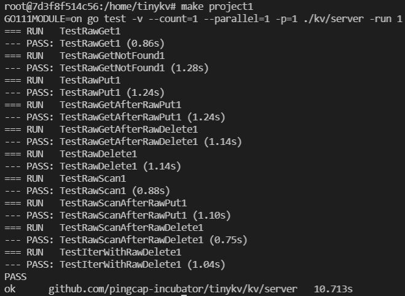

# Project1 StandaloneKV

## 实现

需要完成两个部分：

1. 实现单节点的引擎
2. 实现键值存储的处理函数

Server 依赖于 Storage，需要为位于 kv/storage/standalone_storage/standalone_storage.go 中的独立存储引擎实现接口，这些接口定义在storage.go文件中。在 StandaloneStorage 中实现接口 Storage 后，可以使用它为 Server 实现原始键/值服务。

需重点关注kv目录下的这几个代码文件：

* conf：配置相关结构体
* server：该目录下的raw_api.go是需要补充的文件之一，他是从sever.go中分出来的，Server结构体是与客户端链接的节点，需要实现Put/Delete/Get/Scan这几个操作，这几个操作需要重点关注函数的输入和输出以及错误判断。还有server_test.go这个是测试文件，project1项目完成后用该文件进行测试。
* storage：主要关注modify.go、storage.go和standalone_storage/standalone_storage.go，这是引擎部分，Server结构体中用到的的storage也就是这里的standalone_storage，所以要先完成storage部分，再完成server部分。
* util：重点关注engine_util下的几个文件，这里面的几个函数需要用到。

## 测试

通过project1测试

## 问题

#### 1.vscode安装go插件失败

解决：使用go mod 代理来安装

	go env -w GO111MODULE=on
	go env -w GOPROXY=https://goproxy.io,direct
#### 2.项目中提到使用`make project1`来完成测试，但是并不知道如何使用

解决：使用教研室服务器Ubuntu跑