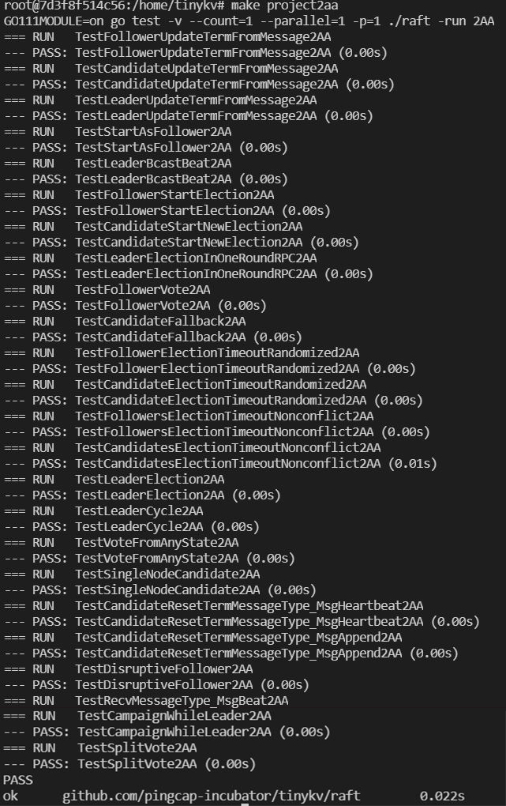
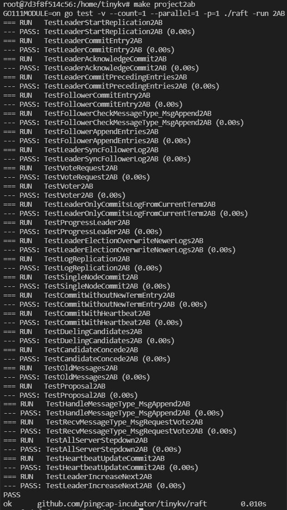
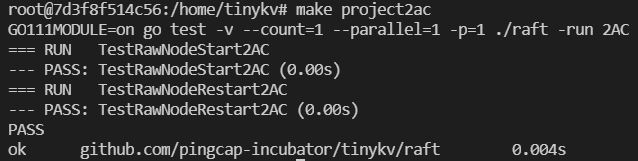
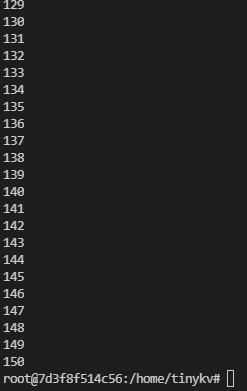

# Project2 RaftKV

**【参考】**

[LX-676655103/Tinykv-2021](https://github.com/LX-676655103/Tinykv-2021/blob/course/doc/project2.md )

[Smith-Cruise/TinyKV-White-Paper](https://github.com/Smith-Cruise/TinyKV-White-Paper/blob/main/Project2-RaftKV.md )

## 2A实现

在这一部分中，将实现基本的 raft 算法。

需要看`raft`目录下的几个文件：

- `raft.go`：主要要补充的文件，实现了Raft算法
- `log.go`：Raft日志的实现
- `raft_paper_test.go`：测试用例
- `raft_test.go`：测试用例
- `proto/pkg/eraftpb/eraft.pb.go`：一些协议值
- `rawnode.go`：2ac接口的实现
- `rawnode_test.go`：2ac测试用例

【**tips**】

* 在raft.Raft、raft.RaftLog、raft.RawNode和eraftpb.proto上添加你需要的任何状态。
* 测试假设第一次启动的筏子应该有0个任期。
* 测试假设新当选的领导者应该在其任期内追加一个noop条目。
* 测试假设，一旦领导者推进其提交索引，它将通过MessageType_MsgAppend消息广播提交索引。
* 测试并没有为本地消息、MessageType_MsgHup、MessageType_MsgBeat和MessageType_MsgPropose设置期限。
* 领导者和非领导者之间的日志条目附加是相当不同的，有不同的来源、检查和处理，要注意这一点。
* 不要忘了选举超时在peers之间应该是不同的。
* rawnode.go中的一些封装函数可以用raft.Step(local message)实现。
* 当启动一个新的raft时，从Storage中获取最后的稳定状态来初始化raft.Raft和raft.RaftLog。

### 1.领导人选举

为了实现领袖选举，需要从raft.Raft.tick()开始，它被用来将内部逻辑时钟提前一个刻度，从而驱动选举超时或心跳超时。现在不需要关心消息的发送和接收逻辑。如果你需要发送消息，只需将其推送到raft.Raft.msgs，raft收到的所有消息将被传递到raft.Raft.Step()。测试代码将从raft.Raft.msgs获取消息，并通过raft.Raft.Step()传递响应消息。raft.Raft.Step()是消息处理的入口，你应该处理像MsgRequestVote、MsgHeartbeat这样的消息及其响应。也需实现测试存根函数，并让它们被正确调用，如raft.Raft.becomeXXX，当筏子的角色改变时，它被用来更新筏子的内部状态。

### 2.日志复制

要实现日志复制，可能需要先在发送方和接收方处理 MsgAppend 和 MsgAppendResponse。 查看`raft/log.go` 中的 raft.RaftLog 是一个帮助管理 raft 日志的辅助结构体，在这里还需要通过 raft/storage.go 中定义的 Storage 接口与上层应用进行交互来获取持久化的数据(像日志条目和快照)。

### 3.原始节点接口

raft/rawnode.go 中的 raft.RawNode 是我们与上层应用交互的接口，raft.RawNode 包含 raft.Raft 并提供了一些包装函数，如 RawNode.Tick() 和 RawNode.Step()。它还提供 RawNode.Propose() 让上层应用程序提出新的 raft 日志。

另一个重要的结构 Ready 也在这里定义。在处理消息或推进逻辑时钟时，raft.Raft 可能需要与上层应用交互。

但这些交互不会立即发生，而是封装在 Ready 中，并由 RawNode.Ready() 返回给上层应用程序。何时调用 RawNode.Ready() 并处理它取决于上层应用程序。上层应用处理完返回的 Ready 后，还需要调用 RawNode.Advance() 等函数来更新 raft.Raft 的内部状态，如应用索引、稳定日志索引等。


## 2B实现

首先，位于 kv/storage/raft_storage/raft_server.go 的 RaftStorage 代码，它也实现了 Storage 接口。与 StandaloneStorage 直接从底层引擎写入或读取不同，它首先将每个写入或读取请求发送到 Raft，然后在 Raft 提交请求后对底层引擎进行实际的写入和读取。通过这种方式，可以保持多个 Store 之间的一致性。

RaftStorage 主要是创建一个 Raftstore 来驱动 Raft。在调用Reader或Write函数时，实际上是通过channel将proto/proto/raft_cmdpb.proto中定义的具有四种基本命令类型（Get/Put/Delete/Snap）的RaftCmdRequest发送到raftstore（channel的接收者是raftWorker的raftCh ) 并在 Raft 提交并应用命令后返回响应。而现在Reader and Write函数的kvrpc.Context参数就派上用场了，它承载了客户端视角的Region信息，作为RaftCmdRequest的header传递。可能信息是错误的或陈旧的，所以 raftstore 需要检查它们并决定是否提出请求。

raftstore的入口是Raftstore，见kv/raftstore/raftstore.go。它会启动一些工作人员来异步处理特定的任务，而且现在大部分都没有使用，所以可以忽略它们。只需要关注 raftWorker。(kv/raftstore/raft_worker.go)

整个过程分为两部分：raft worker 轮询 raftCh 获取消息，消息包括驱动 Raft 模块的 base tick 和作为 Raft 条目提出的 Raft 命令；它从 Raft 模块获取并处理就绪，包括发送 raft 消息、持久化状态、将提交的条目应用到状态机。应用后，将响应返回给客户端。

### 1.实现peer存储

Peer storage 是通过 A 部分的 Storage 接口与之交互的东西，但是除了 raft log 之外，peer storage 还管理其他持久化的元数据，这对于在重启后恢复一致的状态机非常重要。此外，在 proto/proto/raft_serverpb.proto 中定义了三个重要的状态：

- RaftLocalState：用于存储当前 Raft 的 HardState 和最后的 Log Index。
- RaftApplyState：用于存储 Raft 应用的最后一个 Log 索引和一些截断的 Log 信息。
- RegionLocalState：用于在这个Store上存储Region信息和对应的Peer状态。 Normal 表示该 Peer 正常，Tombstone 表示该 Peer 已从 Region 中移除，无法加入 Raft Group。

这些状态存储在两个badger实例中：raftdb 和 kvdb：

- raftdb 存储 raft 日志和 RaftLocalState
- kvdb 将键值数据存储在不同的列族中，RegionLocalState 和 RaftApplyState。你可以把 kvdb 看成是 Raft 论文中提到的状态机

格式如下，在 kv/raftstore/meta 中提供了一些辅助函数，并通过 writebatch.SetMeta() 将它们设置为 badger。

| Key              | KeyFormat                        | Value            | DB   |
| ---------------- | -------------------------------- | ---------------- | ---- |
| raft_log_key     | 0x01 0x02 region_id 0x01 log_idx | Entry            | raft |
| raft_state_key   | 0x01 0x02 region_id 0x02         | RaftLocalState   | raft |
| apply_state_key  | 0x01 0x02 region_id 0x03         | RaftApplyState   | kv   |
| region_state_key | 0x01 0x03 region_id 0x01         | RegionLocalState | kv   |

这些元数据应该在 PeerStorage 中创建和更新。创建 PeerStorage 时，请参见 kv/raftstore/peer_storage.go。它初始化这个Peer的RaftLocalState、RaftApplyState，或者在重启的情况下从底层引擎获取之前的值。注意RAFT_INIT_LOG_TERM和RAFT_INIT_LOG_INDEX的值都是5（只要大于1）而不是0。之所以不设置为0是为了与conf更改后peer被动创建的情况区别开来。

这部分需要实现的代码只有一个函数：PeerStorage.SaveReadyState，这个函数的作用是将raft.Ready中的数据保存到badger，包括追加日志条目和保存Raft硬状态。

要附加日志条目，只需将 raft.Ready.Entries 中的所有日志条目保存到 raftdb 并删除任何以前附加的永远不会提交的日志条目。此外，更新peer存储的 RaftLocalState 并将其保存到 raftdb。

保存hard state也很简单，只需要更新peer storage的RaftLocalState.HardState，保存到raftdb即可。

【**tips**】

- 使用 WriteBatch 一次保存这些状态。
- 有关如何读取和写入这些状态的信息，请参阅 peer_storage.go 中的其他函数。
- 设置可以帮助您调试的环境变量 LOG_LEVEL=debug，另请参阅所有可用的日志级别。

#### Append()

将 Ready 中的 entries 持久化到 raftDB 中，并移除永远不会被 commit 的数据。最后更新 RaftLocalState 的状态。

#### ApplySnapshot()

1. 负责应用 Snapshot，先通过 `ps.clearMeta` 和 `ps.clearExtraData()` 清除原来的数据，因为新的 snapshot 会包含新的 meta 信息，需要先清除老的。
2. 根据 Snapshot 的 Metadata 信息更新当前的 raftState 和 applyState。并保存信息到 WriteBatch 中，可以等到 `SaveReadyState()` 方法结束时统一写入 DB。
3. 发送 `RegionTaskApply` 到 `regionSched` 安装 snapshot。

#### SaveReadyState()

这个方法主要是负责持久化 Ready 中的数据。

1. 判断是否有 Snapshot，如果有 Snapshot，先调用 `ApplySnapshot()` 方法应用。可以通过 `raft.isEmptySnap()` 方法判断是否存在 Snapshot。(**该步骤在2C中完成**)
2. 调用 `Append()` 方法将需要持久化的 entries 保存到 raftDB。
3. 保存 ready 中的 HardState 到 `ps.raftState.HardState`，注意先使用 `raft.isEmptyHardState()` 进行判空。
4. 持久化 RaftLocalState 到 raftDB。
5. 最后通过 `MustWriteToDB()` 方法写入。

### 2.实现raft准备过程

在 project2 A 部分中，已经构建了一个基于 Tick 的 Raft 模块。现在需要编写外部进程来驱动它。大部分代码已经在 kv/raftstore/peer_msg_handler.go 和 kv/raftstore/peer.go 下实现。所以需要学习代码，完成proposeRaftCommand和HandleRaftReady的逻辑。以下是对框架的一些解释。

Raft RawNode 已经使用 PeerStorage 创建并存储在 peer 中。在 raft worker 中，你可以看到它接受了 peer 并被 peerMsgHandler 包裹起来。 peerMsgHandler主要有两个功能：一个是HandleMsg，一个是HandleRaftReady。

HandleMsg 处理从 raftCh 接收到的所有消息，包括调用 RawNode.Tick() 来驱动 Raft 的 MsgTypeTick、包装来自客户端的请求的 MsgTypeRaftCmd 和在 Raft  peers之间传输的消息的 MsgTypeRaftMessage。所有消息类型都定义在 kv/raftstore/message/msg.go 中。您可以查看详细信息，其中一些将在以下部分中使用。

消息处理完之后，Raft 节点应该会有一些状态更新。因此，HandleRaftReady 应该从 Raft 模块中获取准备就绪，并执行相应的操作，例如持久化日志条目、应用提交的条目以及通过网络向其他peers发送 raft 消息。

在伪代码中，raftstore 使用 Raft，如下所示：

```go
for {
  select {
  case <-s.Ticker:
    Node.Tick()
  default:
    if Node.HasReady() {
      rd := Node.Ready()
      saveToStorage(rd.State, rd.Entries, rd.Snapshot)
      send(rd.Messages)
      for _, entry := range rd.CommittedEntries {
        process(entry)
      }
      s.Node.Advance(rd)
    }
}
```

在此之后，读取或写入的整个过程将是这样的：

- 客户端调用 RPC RawGet/RawPut/RawDelete/RawScan
- RPC handler 调用 RaftStorage 相关方法
- RaftStorage 向 raftstore 发送 Raft 命令请求，并等待响应
- RaftStore 将 Raft 命令请求作为 Raft 日志提出
- Raft 模块附加日志，并由 PeerStorage 持久化
- Raft 模块提交日志
- Raft worker 在处理 Raft 就绪时执行 Raft 命令，并通过回调返回响应
- RaftStorage 接收回调的响应并返回给 RPC 处理程序
- RPC 处理程序执行一些操作并将 RPC 响应返回给客户端。

应该运行 make project2b 以通过所有测试。整个测试运行一个模拟集群，包括多个带有模拟网络的 TinyKV 实例。它执行一些读写操作并检查返回值是否符合预期。

需要注意的是，错误处理是通过测试的重要部分。在 proto/proto/errorpb.proto 中定义了一些错误，错误是 gRPC 响应的一个字段。另外，实现error接口的对应错误定义在kv/raftstore/util/error.go中，所以你可以将它们作为函数的返回值。

这些错误主要与Region有关。所以它也是 RaftCmdResponse 的 RaftResponseHeader 的成员。在提出请求或应用命令时，可能会出现一些错误。如果是这样，您应该返回带有错误的 raft 命令响应，然后错误将进一步传递给 gRPC 响应。当返回带有错误的响应时，可以使用 kv/raftstore/cmd_resp.go 中提供的 BindErrResp 将这些错误转换为 errorpb.proto 中定义的错误。

在这个阶段，你可能会考虑这些错误，其他的会在project3中处理：

- ErrNotLeader：raft 命令是在一个跟随者上提出的。所以用它来让客户端尝试其他peer。
- ErrStaleCommand：可能是由于领导者的变化，一些日志没有被提交并被新领导者的日志覆盖。但客户不知道，仍在等待响应。因此，您应该返回它以让客户端知道并再次重试该命令。

【**tips**】

- PeerStorage 实现了 Raft 模块的 Storage 接口，应该使用提供的方法 SaveRaftReady() 来持久化 Raft 相关的状态。
- 使用engine_util 中的WriteBatch 以原子方式进行多次写入，例如，需要确保应用提交的条目并在一个写入批处理中更新应用的索引。
- 使用 Transport 将 raft 消息发送给其他peers，它在 GlobalContext 中。
- 如果服务器不属于多数且没有最新数据，则服务器不应完成获取 RPC。可以将 get 操作放入 raft 日志中，或者对 Raft 论文第 8 节中描述的只读操作进行优化。
- 应用日志条目时，不要忘记更新并保持应用状态。
- 可以像 TiKV 一样以异步方式应用提交的 Raft 日志条目。这不是必需的。
- 记录提议时命令的回调，申请后返回回调。
- 对于 snap 命令响应，应将 badger Txn 设置为显式回调。
- 在 2A 之后，有些测试可能需要多次运行才能发现错误

#### HandleRaftReady()

1. 通过 `d.RaftGroup.HasReady()` 方法判断是否有新的 Ready，没有的话就什么都不用处理。

2. 如果有 Ready 先调用 `d.peerStorage.SaveReadyState(&ready)` 将 Ready 中需要持久化的内容保存到 badger。

   如果 Ready 中存在 snapshot，则应用它（**这一步在2C中完成**）。

3. 然后调用 `d.Send(d.ctx.trans, ready.Messages)` 方法将 Ready 中的 Messages 发送出去。

4. Apply `ready.CommittedEntries` 中的 entry。

5. 调用 `d.RaftGroup.Advance(ready)` 方法推进 RawNode。


## 2C实现

在本部分中，将在上述两部分实现的基础上实现快照处理。一般来说，Snapshot 只是一个类似于 AppendEntries 的 raft 消息，用于将数据复制到 follower，不同的是它的大小，Snapshot 包含了某个时间点的整个状态机数据，并且一次构建和发送这么大的消息会消耗大量资源和时间，可能会阻塞其他 raft 消息的处理，为了解决这个问题，Snapshot 消息将使用独立的连接，并将数据拆分成块进行传输。

需要更改的只是基于 A 部分和 B 部分中编写的代码。

### 1.在 Raft 中实现

见 proto 文件中eraftpb.Snapshot 的定义，eraftpb.Snapshot 上的data 字段并不代表实际的状态机数据，但上层应用使用了一些元数据，暂时可以忽略。当leader需要向follower发送Snapshot消息时，可以调用Storage.Snapshot()获取eraftpb.Snapshot，然后像其他raft消息一样发送snapshot消息。状态机数据实际是如何构建和发送的，是由raftstore实现的，下一步会介绍。可以假设，一旦 Storage.Snapshot() 返回成功，Raft leader 就可以安全地将快照消息发送给 follower，follower 应该调用 handleSnapshot 来处理，也就是像 term、commit index 一样恢复 raft 内部状态从消息中的eraftpb.SnapshotMetadata 中获取成员信息等，然后完成快照处理过程。

### 2.在 raftstore 中实现

在这一步，你需要再学习 raftstore 的两个 worker——raftlog-gc worker 和 region worker。

Raftstore 会根据配置 RaftLogGcCountLimit 时时检查是否需要 gc log，见 onRaftGcLogTick()。如果是，它将提出一个 raft 管理命令 CompactLogRequest，它被包裹在 RaftCmdRequest 中，就像 project2 部分 B 中实现的四种基本命令类型（Get/Put/Delete/Snap）一样。然后您需要在 Raft 提交时处理此管理命令.但与 Get/Put/Delete/Snap 命令写入或读取状态机数据不同，CompactLogRequest 修改元数据，即更新 RaftApplyState 中的 RaftTruncatedState。之后，您应该通过 ScheduleCompactLog 将任务安排到 raftlog-gc worker。 Raftlog-gc worker 将异步执行实际的日志删除工作。

然后由于日志压缩，Raft 模块可能需要发送快照。 PeerStorage 实现 Storage.Snapshot()。 TinyKV 生成快照并在 region worker 中应用快照。当调用 Snapshot() 时，它实际上是向 region worker 发送了一个任务 RegionTaskGen。 region worker 的消息处理器位于 kv/raftstore/runner/region_task.go。它扫描底层引擎以生成快照，并按通道发送快照元数据。 Raft 下次调用 Snapshot 时，会检查快照生成是否完成。如果是，Raft 应该将快照消息发送给其他节点，快照发送和接收工作由 kv/storage/raft_storage/snap_runner.go 处理。你不需要深入细节，只需要知道快照消息将在收到快照后由 onRaftMsg 处理。

那么snapshot会反映在下一个Raft ready，所以你应该做的任务就是修改raft ready进程来处理snapshot的情况。当您确定应用快照时，您可以更新对等存储的内存状态，如 RaftLocalState、RaftApplyState 和 RegionLocalState。另外，不要忘记将这些状态持久化到 kvdb 和 raftdb，并从 kvdb 和 raftdb 中删除陈旧状态。此外，您还需要将 PeerStorage.snapState 更新为 snap.SnapState_Applying 并通过 PeerStorage.regionSched 将 runner.RegionTaskApply 任务发送给 region worker 并等待 region worker 完成。

运行 make project2c 以通过所有测试。


##  测试

#### 2A测试

全部通过







#### 2B测试



#### 2C测试


## 问题

#### 1.`MessageType_MsgBeat`和`MessageType_MsgHeartbeat`两个信号类型有什么区别？

解决：`MessageType_MsgBeat`：领导者告诉自己需要发送'MessageType_MsgHeartbeat'类型的心跳给他的跟随者们

`MessageType_MsgHeartbeat`：从领导者发送心跳到他的追随者的信号

#### 2.Ready结构体中Entries和CommittedEntries的含义

Entries指的是在发送消息之前需要保存到稳定存储的表项，即未持久化的日志条目，即stabled之后的entry；

CommittedEntries指的是要提交到状态机的条目，即已提交但还未应用到状态机的条目，即applied到 commited之间所有的 entry。

#### 3.一直显示超时`dial tcp 142.251.43.17:443: i/o timeout`

解决：`go env -w GOPROXY=https://goproxy.cn`

