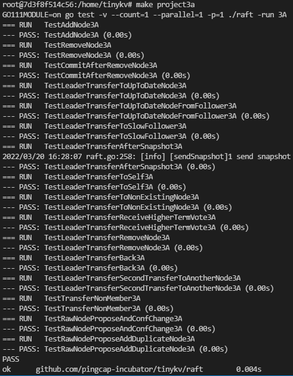
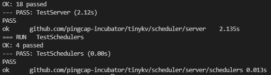

# Project3 MultiRaftKV

在这个项目中，将实现一个基于多 raft 的 kv 服务器和 balance scheduler，它由多个 raft 组组成，每个 raft 组负责一个单独的键范围，这里命名为 region，布局将如图所示。对单个区域的请求像以前一样处理，但是多个区域可以同时处理请求，这提高了性能，但也带来了一些新的挑战，例如平衡对每个区域的请求等。


这个项目有 3 个部分，包括：

1. 对 Raft 算法实施成员变更和领导层变更
2. 在 raftstore 上实现 conf 更改和区域拆分
3. 引入调度器

## 3A实现

在这一部分中，将实现基本 raft 算法的成员更改和领导更改，这些功能是接下来两部分所需要的。 Membership change，即conf change，是用来增加或删除raft group的peer，可以改变raft group的quorum，所以要小心。领导变更，即领导转移，用于将领导转移到另一个同行，这对于平衡非常有用。

需要修改的代码都是关于 raft/raft.go 和 raft/rawnode.go 的，您还需要查看 proto/proto/eraft.proto 来了解您需要处理的新消息。并且 conf 更改和 leader 转移都是由上层应用程序触发的，因此希望从 raft/rawnode.go 开始。

### 1.实现领导转移

为了实现领导者转移，引入两种新的消息类型：MsgTransferLeader 和 MsgTimeoutNow。转移leader需要先在当前leader上调用raft.Raft.Step和MsgTransferLeader消息，为了保证转移成功，当前leader首先要检查被转移者的资格（即转移目标）比如：是否转移者的日志过时 等。如果受让人不合格，当前leader可以选择中止传输或者帮助受让人（这里选择帮助）。如果受让人的日志不是最新的，当前的领导者应该向受让人发送一条 MsgAppend 消息并停止接受新的提议，以防我们结束循环。所以如果被调动者是合格的（或者在当前leader的帮助下），leader应该立即向被调动者发送MsgTimeoutNow消息，并且在收到MsgTimeoutNow消息后，无论选举超时如何，被调动者都应该立即开始新的选举，具有更高的任期和最新日志，受让人有很大机会辞去现任领导者并成为新领导者。

**具体步骤：**

1. 先判断自己是不是 Leader，因为只有 Leader 才有权利转移，否则直接开始选举。
2. 判断自己的 `leadTransferee` 是否为空，如果不为空，则说明已经有 Leader Transfer 在执行，忽略本次。如果正在执行的 `leadTransferee` 和你要转移目标的不同，则终止之前的转移，将 `leadTransferee` 设置为本次转移目标。
3. 如果目标节点拥有和自己一样新的日志，则发送 `pb.MessageType_MsgTimeoutNow` 到目标节点。否则启动 append 流程同步日志。当同步完成后再发送 `pb.MessageType_MsgTimeoutNow`。
4. 当 Leader 的 `leadTransferee` 不为空时，不接受任何 propose，因为正在转移。
6. 目标节点收到 `pb.MessageType_MsgTimeoutNow` 时，应该立刻重置自己的定时器并自增 term 开始选举。

### 2.实施成员变更

这里要实现的 conf change 算法不是扩展 Raft 论文中提到的可以一次添加、删除任意 Peer 的联合共识算法，而是只能一个一个地添加或删除 Peer，更简单易行。此外，conf 更改从调用领导者的 raft.RawNode.ProposeConfChange 开始，它将提出一个条目，其中 pb.Entry.EntryType 设置为 EntryConfChange，pb.Entry.Data 设置为输入 pb.ConfChange。提交 EntryConfChange 类型的条目时，必须通过 RawNode.ApplyConfChange 应用它，并在条目中添加 pb.ConfChange，然后才能通过 raft.Raft.addNode 和 raft.Raft.removeNode 向该 raft 节点添加或删除 peer到 pb.ConfChange。

【**tips**】

- MsgTransferLeader 消息是本地消息，不是来自网络
- 将 MsgTransferLeader 消息的 Message.from 设置为受让人（即传输目标）
- 要立即开始新的选举，可以使用 MsgHup 消息调用 Raft.Step
- 调用 pb.ConfChange.Marshal 获取 pb.ConfChange 的字节表示并将其放入 pb.Entry.Data

### 【参考】

[LX-676655103/Tinykv-2021](https://github.com/LX-676655103/Tinykv-2021/blob/course/doc/project2.md )

[Smith-Cruise/TinyKV-White-Paper](https://github.com/Smith-Cruise/TinyKV-White-Paper/blob/main/Project2-RaftKV.md )


## 3B实现

由于 Raft 模块现在支持成员变更和领导变更，这部分需要在 A 部分的基础上让 TinyKV 支持这些管理命令。在 proto/proto/raft_cmdpb.proto 中可以看到，有四种类型的管理命令：

* CompactLog（已经在项目 2 部分 C 中实现）
* TransferLeader
* ChangePeer
* Split

TransferLeader 和 ChangePeer 是基于 Raft 支持的领导变更和成员变更的命令。这些将用作平衡调度程序的基本操作步骤。 Split 将一个 Region 拆分为两个 Region，这是 multi raft 的基础。

所有的改动都是基于project2的实现，所以需要修改的代码都是kv/raftstore/peer_msg_handler.go和kv/raftstore/peer.go。

### 1.提出转移领导

这一步非常简单。作为 raft 命令，TransferLeader 将被提议为 Raft 条目。但是TransferLeader实际上是一个不需要复制到其他peer的动作，所以只需要调用RawNode的TransferLeader()方法而不是Propose()来调用TransferLeader命令。

### 2.在 raftstore 中实现成员变更

conf 更改有两种不同的类型，AddNode 和 RemoveNode。正如它的名字所暗示的，它在 Region 中添加一个 Peer 或删除一个 Peer。要实现 conf 更改，应该首先学习 RegionEpoch 的术语。 RegionEpoch 是 metapb.Region 元信息的一部分。当一个 Region 添加或删除 Peer 或拆分时，该 Region 的 epoch 发生了变化。 RegionEpoch 的 conf_ver 在 ConfChange 期间增加，而在拆分期间版本增加。用于保证一个Region中的两个Leader在网络隔离下的最新Region信息。

需要使 raftstore 支持处理 conf 更改命令。该过程将是：

1. 通过 ProposeConfChange 提出 conf 更改管理命令
2. 日志提交后，更改 RegionLocalState，包括 RegionEpoch 和 Region 中的 Peers
3. 调用 raft.RawNode 的 ApplyConfChange()

【**tips**】

- 执行 AddNode 时，新添加的 Peer 会通过 leader 的心跳创建，查看 storeWorker 的 MaybeCreatePeer()。当时这个Peer是未初始化的，它的Region的任何信息我们都不知道，所以我们用0来初始化它的Log Term和Index。然后leader会知道这个Follower没有数据（存在从0到5的Log gap），它会直接向这个Follower发送快照。
- 要执行 RemoveNode，应该显式调用 destroyPeer() 以停止 Raft 模块。它提供了销毁逻辑。
- 不要忘记更新 GlobalContext 的 storeMeta 中的区域状态。
- 测试代码会多次调度一次 conf 更改的命令，直到应用 conf 更改，因此需要考虑如何忽略相同 conf 更改的重复命令。

**具体步骤：**

1. 读取原有的 region，调用 `d.Region()` 即可
2. 修改 `region.Peers`，是删除就删除，是增加就增加一个 peer。如果删除的目标节点正好是自己本身，那么直接调用 `d.destroyPeer()` 方法销毁自己，并直接 return。后面的操作你都不用管了。
3. 设置 `region.RegionEpoch.ConfVer++`。
4. 持久化修改后的 Region，写到 kvDB 里面。使用 `meta.WriteRegionState()` 方法。注意使用的是 `rspb.PeerState_Normal`，因为其要正常服务请求的。
5. 调用 `d.insertPeerCache()` 或 `d.removePeerCache()` 方法，这决定了你的消息是否能够正常发送，`peer.go` 里面的 `peerCache`注释上说明了为什么这么做。
6. 调用 `d.RaftGroup.ApplyConfChange()` 方法，因为刚刚修改的是 RawNode 上层的 peers 信息，Raft 内部的 peers 还没有修改。

### 3.在 raftstore 中实现分割区域

为了支持多 raft，系统会进行数据分片，让每个 Raft 组只存储一部分数据。哈希和范围通常用于数据分片。 TinyKV使用Range，主要是Range可以更好的聚合相同前缀的key，方便scan等操作。此外，Range 在 split 中的表现优于 Hash。通常，它只涉及元数据修改，不需要移动数据。

Region的定义中包含两个字段start_key和end_key，表示Region负责的数据范围。所以拆分是支持多raft的关键步骤。一开始，只有一个 Region 的范围为 [“”, “”)。可以将key空间视为一个循环，因此 [“”, “”) 代表整个空间。写入数据后，split checker会每隔cfg.SplitRegionCheckTickInterval检查region的大小，如果可能的话会生成一个split key将Region分成两部分，你可以查看kv/raftstore/runner/split_check.go中的逻辑。split key将被包装为由 onPrepareSplitRegion() 处理的 MsgSplitRegion。

为了确保新创建的 Region 和 Peers 的 id 是唯一的，这些 id 由调度程序分配。它也提供了，因此不必实现它。 onPrepareSplitRegion() 实际上为 pd 工作人员安排了一个任务，以向调度程序询问 id。并在收到调度程序的响应后发出拆分管理命令，请参见 kv/raftstore/runner/scheduler_task.go 中的 onAskSplit()。

因此，任务是实现处理拆分管理命令的过程，就像 conf 更改一样。提供的框架支持多个 raft，参见 kv/raftstore/router.go。当一个 Region 拆分为两个 Region 时，其中一个 Region 会继承拆分前的元数据，只修改其 Range 和 RegionEpoch，而另一个会创建相关的元信息。

【**tips**】

- 这个新创建的 Region 对应的 Peer 应该由 createPeer() 创建并注册到 router.regions。并且区域的信息应该被插入到 ctx.StoreMeta 中的 regionRanges 中。
- 对于使用网络隔离的区域拆分案例，要应用的快照可能与现有区域的范围重叠。检查逻辑在 kv/raftstore/peer_msg_handler.go 中的 checkSnapshot() 中。请在实施时牢记这一点并照顾好这种情况。
- 使用 engine_util.ExceedEndKey() 与区域的结束键进行比较。因为当结束键等于“”时，任何键都将等于或大于“”。 还有更多错误需要考虑：ErrRegionNotFound、ErrKeyNotInRegion、ErrEpochNotMatch。

**Apply split 流程**

1. 基于原来的 region clone 一个新 region，这里把原来的 region 叫 leftRegion，新 region 叫 rightRegion。Clone region 可以通过 `util.CloneMsg()` 方法。
2. leftRegion 和 rightRegion 的 `RegionEpoch.Version++`。
3. 修改 rightRegion 的 Id，StartKey，EndKey 和 Peers。
4. 修改 leftRegion 的 EndKey。
5. 持久化 leftRegion 和 rightRegion 的信息。
6. 通过 `createPeer()` 方法创建新的 peer 并注册进 router，同时发送 `message.MsgTypeStart` 启动 peer。
7. 更新 storeMeta 里面的 regionRanges，同时使用 `storeMeta.setRegion()` 进行设置。注意加锁。
8. 调用 `d.HeartbeatScheduler()`。因为存在新 region 的 Leader 还没选出来，测试用例已经超时的问题，通常报的错是 no region 问题。


## 3C实现

正如上面所指示的，kv 存储中的所有数据都被分成几个区域，每个区域都包含多个副本。出现了一个问题：应该将每个副本放在哪里？如何才能找到复制品的最佳位置？谁发送以前的 AddPeer 和 RemovePeer 命令？调度器承担了这个责任。

为了做出明智的决定，调度器应该有一些关于整个集群的信息。它应该知道每个 region 的位置。它应该知道他们有多少个 keys 。它应该知道它们有多大……为了获取相关信息，Scheduler 要求每个 Region 都要定期向 Scheduler 发送心跳请求。可以在 /proto/proto/schedulrpb.proto 中找到心跳请求结构 RegionHeartbeatRequest。调度器收到心跳后，会更新本地区域信息。

同时，Scheduler 会定期检查区域信息，以发现我们的 TinyKV 集群中是否存在不平衡。例如，如果任何 store 包含太多区域，则应将区域从它移动到其他 store 。这些命令将被拾取作为相应区域的心跳请求的响应。

在这一部分中，需要为 Scheduler 实现上述两个功能。

需要修改的代码都是关于 scheduler/server/cluster.go 和 scheduler/server/schedulers/balance_region.go 的。如上所述，当Scheduler收到一个区域心跳时，它会首先更新其本地区域信息。然后它将检查该区域是否有待处理的命令。如果有，它将作为响应发回。

只需要实现processRegionHeartbeat函数，其中Scheduler更新本地信息；和 Schedule 平衡区域调度，调度器在其中扫描存储并确定是否存在不平衡以及它应该移动到哪个区域。

### 1.收集区域心跳

processRegionHeartbeat 函数的唯一参数是 regionInfo。它包含有关此心跳的发送者区域的信息。调度器需要做的只是更新本地区域记录。但它应该为每次心跳更新这些记录吗？

当然不！有两个原因。一是当没有对该区域进行任何更改时，可以跳过更新。更重要的是，Scheduler 不能信任每一个心跳。具体来说，如果集群在某个部分有分区，则某些节点的信息可能是错误的。

比如有些 Region 分裂后会重新发起选举和分裂，但另一批孤立的节点仍然通过心跳将过时的信息发送给 Scheduler。所以对于一个 Region，两个节点中的任何一个都可能说它是领导者，这意味着调度程序不能同时信任它们。

哪个更可信？ Scheduler 应该使用 conf_ver 和 version 来确定它，即 RegionEpoch。 Scheduler 应该首先比较两个节点的 Region 版本的值。如果值相同，则调度程序比较配置更改版本的值。具有较大配置更改版本的节点必须具有更新的信息。

简单地说，可以按以下方式组织检查程序：

1. 检查本地存储中是否有相同Id的区域。如果存在且至少有一个心跳的 conf_ver 和 version 小于其，则该心跳区域已过时
2. 如果没有，请扫描与其重叠的所有区域。 heartbeat 的 conf_ver 和 version 应该大于或等于所有这些，否则该区域已过时。

那么调度器如何判断是否可以跳过这个更新呢？可以列出一些简单的条件：

* 如果新version或conf_ver大于原版本，则不能跳过
* 如果leader发生变化，则不能跳过
* 如果新的或原来的有待处理的peer，不能被跳过
* 如果 ApproximateSize 发生变化，则不能跳过
* …

不需要找到一个严格的充分必要条件。冗余更新不会影响正确性。

如果 Scheduler 决定根据这个心跳更新本地存储，它应该更新两件事：区域树和存储状态。可以使用 RaftCluster.core.PutRegion 来更新区域树，并使用 RaftCluster.core.UpdateStoreStatus 来更新相关存储的状态（例如领导者计数、区域计数、待定节点计数……）。

### 2.实施区域平衡调度程序

在 Scheduler 中可以运行多种不同类型的调度器，例如 balance-region 调度器和 balance-leader 调度器。本次将重点介绍平衡区域调度程序。

每个调度器都应该实现了调度器接口，可以在 /scheduler/server/schedule/scheduler.go 中找到它。 Scheduler 将使用 GetMinInterval 的返回值作为默认间隔来定期运行 Schedule 方法。如果它返回 null（多次重试），调度程序将使用 GetNextInterval 来增加间隔。通过定义 GetNextInterval，可以定义间隔如何增加。如果返回一个 operator ，调度器将调度这些 operators 作为相关区域下一次心跳的响应。

Scheduler 接口的核心部分是 Schedule 方法。该方法的返回值为 Operator，其中包含 AddPeer 和 RemovePeer 等多个步骤。例如，MovePeer 可能包含在前一部分中实现的 AddPeer、transferLeader 和 RemovePeer。以下图中的第一个 RaftGroup 为例。调度程序尝试将peer从第三个store移动到第四个。首先，它应该为第四个store AddPeer。然后检查第三个是否是leader，发现不是，则不需要transferLeader。然后它删除第三个store中的peer。

可以使用 scheduler/server/schedule/operator 包中的 CreateMovePeerOperator 函数来创建 MovePeer operator。


在这一部分中，需要实现的唯一功能是 scheduler/server/schedulers/balance_region.go 中的 Schedule 方法。此调度程序可避免一个 store 中的区域过多。首先，Scheduler 会选择所有合适的 store。然后根据它们的区域大小对它们进行排序。然后调度程序尝试从具有最大区域大小的 store 中找到要移动的区域。

调度程序将尝试找到最适合在 store 中移动的区域。首先，它会尝试选择一个挂起的区域，因为挂起可能意味着磁盘过载。如果没有待处理的区域，它将尝试找到一个 follower 区域。如果仍然无法挑选出一个区域，它将尝试挑选 leader 区域。最后，它将选择要移动的区域，或者调度程序将尝试下一个具有较小区域大小的 store，直到尝试完所有 store。

在选择一个区域进行移动后，调度程序将选择一个 store 作为目标。实际上，Scheduler 会选择 region size 最小的 store。然后调度器会通过检查原始存储和目标存储的区域大小的差异来判断这个移动是否有价值。如果差异足够大，调度程序应该在目标存储上分配一个新的 peer 并创建一个移动 peer operator。

上面的例程只是一个粗略的过程。留下很多问题：

* 哪些store适合移动？
  总之，一个合适的 store 应该是 up 同时 down 时间不能长于集群的 MaxStoreDownTime，可以通过 cluster.GetMaxStoreDownTime() 获取。
* 如何选择 region ？
  Scheduler 框架提供了三种获取区域的方法。 GetPendingRegionsWithLock、GetFollowersWithLock 和 GetLeadersWithLock。 Scheduler 可以从中获取相关区域。然后可以选择一个随机区域。
* 如何判断这个操作是否有价值？
  如果原始 store 和目标 store 的 region size 相差太小，那么在我们将 region 从原始 store 移动到目标 store 之后，Scheduler 下次可能要再次移动回来。所以我们要保证这个差值必须大于区域近似大小的两倍，这样才能保证移动后目标 store 的区域大小仍然小于原始 store 。

**具体步骤**

1. 选出 suitableStores，并按照 regionSize 进行排序。SuitableStore 是那些满足 `DownTime()` 时间小于 `MaxStoreDownTime` 的 store。
2. 开始遍历 suitableStores，从 regionSize 最大的开始遍历，依次调用 `GetPendingRegionsWithLock()`，`GetFollowersWithLock()` 和 `GetLeadersWithLock()`。直到找到一个目标 region。如果实在找不到目标 region，直接放弃本次操作。
3. 判断目标 region 的 store 数量，如果小于 `cluster.GetMaxReplicas()`，直接放弃本次操作。
4. 再次从 suitableStores 开始遍历，这次从 regionSize 最小的开始遍历，选出一个目标 store，目标 store 不能在原来的 region 里面。如果目标 store 找不到，直接放弃。
5. 判断两个 store 的 regionSize 是否小于 `2*ApproximateSize` 。是的话直接放弃。
6. 调用 `cluster.AllocPeer()` 创建 peer，创建 `CreateMovePeerOperator` 操作，返回结果。


##  测试

#### 3A测试

全部通过



#### 3B测试

未完全通过，存在request timeout问题！

#### 3C测试



## 问题

#### 1.3a的TestRemoveNode3A测试会报panic错误，发现是移除最后一个节点的时候出现了问题

在removeNode函数里加了个判断

```go
if r.id == id {
    r.Prs = make(map[uint64]*Progress)
    return
}
```

#### 2.删除节点时会遇到 Request timeout 问题

首先这种情况发生在测试用例是设置了网络是 unreliable 的，且存在 remove node 到最后两个节点，然后被 remove 的那个正好是 Leader。

因为网络是 unreliable，Leader 广播给另一个 Node 的心跳正好被丢了，也就是另一个节点的 commit 并不会被推进，也就是对方节点并不会执行 remove node 操作。而这一切 Leader 并不知道，它自己调用 `d.destroyPeer()` 已经销毁了。此时另一个节点并没有移除 Leader，它会发起选举，但是永远赢不了，因为需要收到被移除 Leader 的投票。

解决办法：在 propose 阶段，如果已经处于两节点，被移除的正好是 Leader，那么直接拒绝该 propose，并且发起 Transfer Leader 到另一个节点上即可。Client 到时候会重试 remove node 指令。