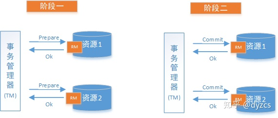
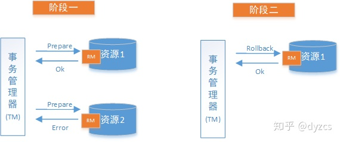
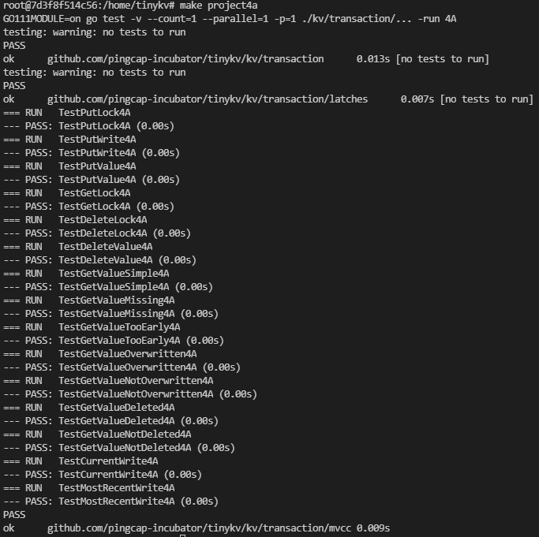
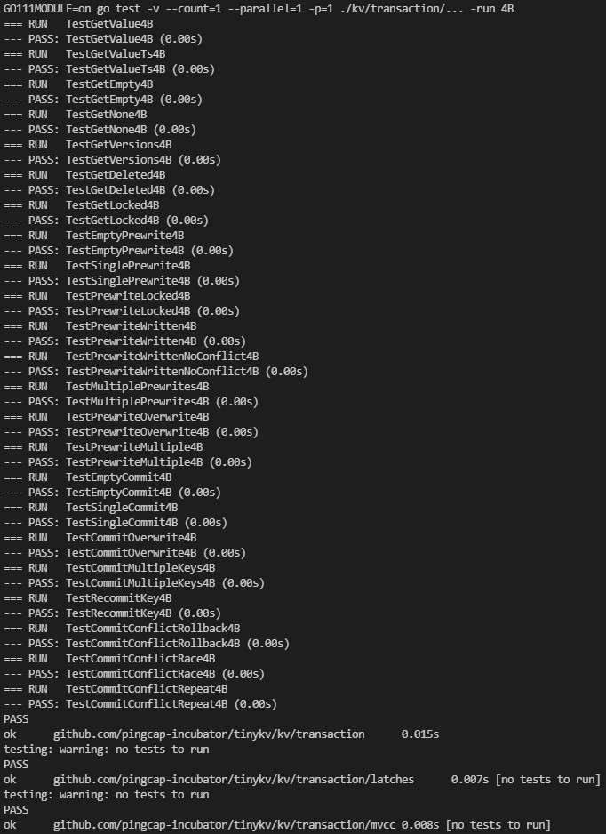
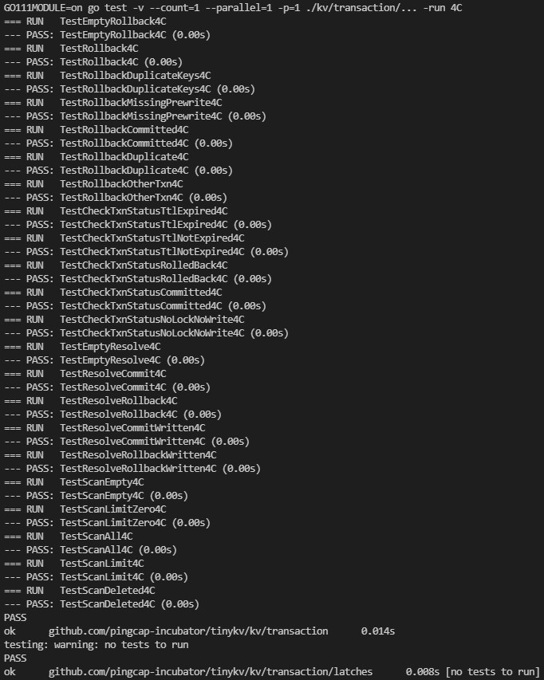
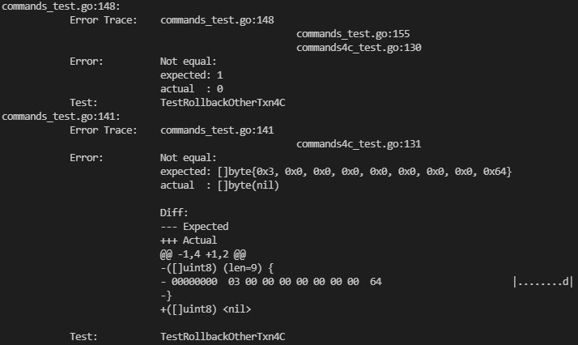

# Project3 Transactions

**【参考】**

[LX-676655103/Tinykv-2021](https://github.com/LX-676655103/Tinykv-2021/blob/course/doc/project2.md )

[Smith-Cruise/TinyKV-White-Paper](https://github.com/Smith-Cruise/TinyKV-White-Paper/blob/main/Project2-RaftKV.md )

在之前的项目中，已经构建了一个键/值数据库，通过使用 Raft，该数据库在多个节点之间是一致的。为了真正具有可扩展性，数据库必须能够处理多个客户端。对于多个客户端，存在一个问题：如果两个客户端尝试“同时”写入相同的 key 会发生什么？如果客户端写入然后立即读取该 key，是否应该期望读取的值与写入的值相同？在 project4 中，将解决此类问题。

事务系统将是客户端（TinySQL）和服务器（TinyKV）之间的协作协议。必须正确实施两个合作伙伴才能确保交易属性。我们将为事务请求提供完整的 API，独立于在 project1 中实现的原始请求（事实上，如果客户端同时使用原始 API 和事务 API，无法保证事务属性）。

事务承诺快照隔离（SI）。这意味着在事务中，客户端将从数据库中读取，就好像它在事务开始时被及时冻结（事务看到数据库的一致视图）。一个事务要么全部写入数据库，要么一个都不写入（如果它与另一个事务冲突）。

要提供 SI，需要更改数据在后备存储中的存储方式。将存储一个键值和一个时间（由时间戳表示），而不是为每个键存储一个值。这称为多版本并发控制 (MVCC)，因为每个键都存储了多个不同版本的值。

将在 A 部分中实现 MVCC。在 B 部分和 C 部分中，将实现事务性 API。

需要提前了解2PC、MVCC、Percolator的知识！

#### Transactions in TinyKV

TinyKV 的交易设计遵循 Percolator；它是一个两阶段提交协议（2PC）。

事务是读取和写入的列表。一个事务有一个开始时间戳，当一个事务被提交时，它有一个提交时间戳（它必须大于开始时间戳）。整个事务从在开始时间戳有效的 key 版本中读取。提交后，所有写入似乎都已在提交时间戳处写入。任何要写入的 key 都不能被启动时间戳和提交时间戳之间的任何其他事务写入，否则，整个事务将被取消（这称为写冲突）。

该协议以客户端从 TinyScheduler 获取开始时间戳开始。然后它在本地构建事务，从数据库读取（使用包含开始时间戳的 KvGet 或 KvScan 请求，与 RawGet 或 RawScan 请求相反），但仅在内存中本地记录写入。一旦事务建立，客户端将选择一个键作为主键（注意这与 SQL 主键无关）。客户端向 TinyKV 发送 KvPrewrite 消息。 KvPrewrite 消息包含事务中的所有写入。 TinyKV 服务器将尝试锁定事务所需的所有 key。如果锁定任何 key 失败，那么 TinyKV 会向客户端响应事务失败。客户端可以稍后重试事务（即，使用不同的开始时间戳）。如果所有 key 都被锁定，则预写成功。每个锁存储事务的主键和生存时间 (TTL)。

实际上，由于事务中的 key 可能在多个区域中，因此存储在不同的 Raft 组中，客户端将发送多个 KvPrewrite 请求，每个区域领导者一个。每个预写只包含对该区域的修改。如果所有预写都成功，那么客户端将发送一个包含主键的区域的提交请求。提交请求将包含一个提交时间戳（客户端也从 TinyScheduler 获得），这是提交事务的写入并因此对其他事务可见的时间。

如果任何预写失败，则客户端通过向所有区域发送 KvBatchRollback 请求来回滚事务（以解锁事务中的所有键并删除任何预写值）。

在 TinyKV 中，TTL 检查不是自发进行的。为了启动超时检查，客户端在 KvCheckTxnStatus 请求中将当前时间发送给 TinyKV。该请求通过其主键和开始时间戳来识别事务。锁可能丢失或已经提交；如果没有，TinyKV 会将锁上的 TTL 与 KvCheckTxnStatus 请求中的时间戳进行比较。如果锁超时，那么 TinyKV 会回滚锁。在任何情况下，TinyKV 都会响应锁的状态，以便客户端可以通过发送 KvResolveLock 请求来采取行动。客户端通常在由于另一个事务的锁定而无法预写事务时检查事务状态。

如果主键提交成功，则客户端将提交其他区域中的所有其他键。这些请求应该总是成功的，因为通过积极响应预写请求，服务器承诺如果它收到该事务的提交请求，那么它将成功。一旦客户端获得了所有的预写响应，事务失败的唯一方法就是超时，在这种情况下，提交主键应该会失败。一旦主键被提交，那么其他键就不能再超时。

如果主键提交失败，则客户端将通过发送 KvBatchRollback 请求回滚事务。

#### 分布式事务Percolator

[Percolator Paper](http://notes.stephenholiday.com/Percolator.pdf)

[深入理解分布式事务Percolator(一)](https://blog.csdn.net/maxlovezyy/article/details/88572692)

[深入理解分布式事务Percolator(二)](https://blog.csdn.net/maxlovezyy/article/details/99702091)

[深入理解分布式事务Percolator(三)](https://blog.csdn.net/maxlovezyy/article/details/99707690)

分布式系统环境下由不同的服务之间通过网络远程协作完成事务称之为分布式事务。

##### CAP理论

一致性是指写操作后的读操作可以读取到最新的数据状态，当数据分布在多个节点上，从任意结点读取到的数据都是最新的状态。

可用性是指任何事务操作都可以得到响应结果，且不会出现响应超时或响应错误。

分区容忍性是指分布式系统的各各结点部署在不同的子网，不可避免的会出现由于网络问题而导致结点之间通信失败，此时仍可对外提供服务。

##### BASE理论

基本可用：分布式系统在出现故障时，允许损失部分可用功能，保证核心功能可用。

软状态：由于不要求强一致性，所以BASE允许系统中存在中间状态（也叫软状态），这个状态不影响系统可用性，待数据最终一致后状态改为“成功”状态。

最终一致：经过一段时间后，所有节点数据都将会达到一致。

##### Percolator

Percolator 采用了 Snapshot Isolation 来实现 ACID，其并不能避免 write skew问题。

Percolator 提供了 5 种 Column Family 分别为 lock，write，data，notify，ack_O。在 TinyKV 中我们只需要使用 Lock，Write 和 Data。

Data：实际的数据，存在多版本，版本号就是写入事务的 startTs。 Lock：锁标记，版本号就是写入事务的 startTs，同时每一个 lock 上含有 primary key 的值。 Write：Write 上存在 startTs 和 commitTs，startTs 是指向对应 Data 中的版本，commitTs 是这个 Write 的创建时间。

##### Primary Key 作用

Percolator 本质上是一个 2PC，但是传统 2PC 在 Coordinator 挂了的时候，就会留下一堆烂摊子，后续接任者需要根据烂摊子的状态来判断是继续 commit 还是 rollback。而 primary key 在这里的作用就是标记这个烂摊子是继续 commit 还是直接 rollback。

此外，一个事务要保证自身写的操作不会被别的事务干扰（防止写写冲突）。Percolator 在所有的 key 上加了 lock，而 lock 里面含有 primary key 信息，也就是将这些锁的状态和 primary key 绑定。Primary key 的 lock 在，它们就在；Primary key 的 lock 不在，那么它们的 lock 也不能在。

Primary key 是从写入的 keys 里面随机选的，在 commit 时需要优先处理 primary key。 当 primary key 执行成功后，其他的 key 可以异步并发执行，因为 primary key 写入成功代表已经决议完成了，后面的状态都可以根据 primary key 的状态进行判断。

#### 分布式事务解决方案之2PC

2PC 即两阶段提交协议，是将整个事务流程分为两个阶段，准备阶段、提交阶段。

1. 准备阶段（Prewrite）：事务管理器给每个参与者发送 Prepare 消息，每个数据库参与者在本地执行事务，并写本地的 Undo/Redo 日志，此时事务没有提交。（Undo 日志是记录修改前的数据，用于数据库回滚，Redo 日志是记录修改后的数据，用于提交事务后写入数据文件）
2. 提交阶段（Commit）：如果事务管理器收到了参与者的执行失败或者超时消息时，直接给每个参与者发送回滚（Rollback）消息；否则，发送提交（Commit）消息；参与者根据事务管理器的指令执行提交或者回滚操作，并释放事务处理过程中使用的锁资源。





#### 多版本并发控制MVCC

指的就是在使用`READ COMMITTD`、`REPEATABLE READ`这两种隔离级别的事务在执行普通的`SEELCT`操作时访问记录的`版本链`的过程，这样子可以使不同事务的读-写、写-读操作并发执行，从而提升系统性能。


## 4A实现

在早期项目中实现的原始 API 将用户键和值直接映射到存储在底层存储 (Badger) 中的键和值。由于 Badger 不了解分布式事务层，因此必须在 TinyKV 中处理事务，并将用户键和值编码到底层存储中。这是使用多版本并发控制 (MVCC) 实现的。在这个项目中，将在 TinyKV 中实现 MVCC 层。

实现 MVCC 意味着使用简单的键/值 API 来表示事务 API。 TinyKV 不是为每个键存储一个值，而是为每个键存储一个值的每个版本。例如，如果一个键的值为 10，然后设置为 20，TinyKV 将存储两个值（10 和 20）以及它们何时有效的时间戳。

TinyKV 使用三个列族 (CF)：default 保存用户值，lock 存储锁，write 记录更改。使用用户 key 访问lock CF；它存储了一个序列化的 Lock 数据结构（在 lock.go 中定义）。使用用户 key 和写入它的事务的开始时间戳访问 default CF；它仅存储用户值。使用用户key 和写入它的事务的提交时间戳来访问 write CF；它存储一个 Write 数据结构（在 write.go 中定义）。

用户 key 和时间戳组合成一个编码 key 。key 的编码方式是，编码key 的升序首先按用户 key（升序）排序，然后按时间戳（降序）。这确保了对编码键的迭代将首先给出最新版本。用于编码和解码 key 的辅助函数在 transaction.go 中定义。

此部分需要实现一个名为 MvccTxn 的结构。在 B 部分和 C 部分中，将使用 MvccTxn API 来实现事务 API。 MvccTxn 提供基于用户键和锁、写入和值的逻辑表示的读取和写入操作。修改在 MvccTxn 中收集，一旦收集了命令的所有修改，它们将一次全部写入底层数据库。这可确保命令自动成功或失败。请注意，MVCC 事务与 TinySQL 事务不同。 MVCC 事务包含对单个命令的修改，而不是命令序列。

MvccTxn 在 transaction.go 中定义。有一个存根实现，以及一些用于编码和解码 key 的辅助函数。测试在 transaction_test.go 中。对于本部分，应该实现每个 MvccTxn 方法，以便所有测试都通过。每种方法都记录了其预期行为。

【**tips**】

- MvccTxn 应该知道它所代表的请求的开始时间戳。
- 最具挑战性的实现方法可能是 GetValue 和检索写入的方法。需要使用 StorageReader 来遍历 CF。请记住编码键的顺序，并记住，在决定值何时有效时，取决于事务的提交时间戳，而不是开始时间戳。

#### GetValue()

查询当前事务下，传入 key 对应的 Value。

1. 通过 `iter.Seek(EncodeKey(key, txn.StartTS))` 查找遍历 Write。
2. 判断找到 Write 的 key 是不是就是自己需要的 key，如果不是，说明不存在，直接返回。
3. 判断 Write 的 Kind 是不是 `WriteKindPut`，如果不是，说明不存在，直接返回。
4. 从 Default 中通过 `EncodeKey(key, write.StartTS)` 获取值。

#### CurrentWrite()

查询当前事务下，传入 key 的最新 Write。

1. 通过 `iter.Seek(EncodeKey(key, math.MaxUint64))` 查询该 key 的最新 Write。
2. 如果 `write.StartTS > txn.StartTS`，继续遍历，直到找到 `write.StartTS == txn.StartTS` 的 Write。
3. 返回这个 Write 和 commitTs。

#### MostRecentWrite()

查询传入 key 的最新 Write，这里不需要考虑事务的 startTs。

1. 通过 `iter.Seek(EncodeKey(key, math.MaxUint64))` 查找。
2. 判断目标 Write 的 key 是不是我们需要的，不是返回空，是直接返回该 Write。


## 4B实现

在本部分中，将使用 A 部分中的 MvccTxn 来实现对 KvGet、KvPrewrite 和 KvCommit 请求的处理。如上所述，KvGet 在提供的时间戳从数据库中读取一个值。如果要读取的 key 在 KvGet 请求时被另一个事务锁定，那么 TinyKV 应该返回错误。否则，TinyKV 必须搜索 key 的版本以找到最新的有效值。

KvPrewrite 和 KvCommit 分两个阶段将值写入数据库。这两个请求都对多个键进行操作，但实现可以独立处理每个键。

KvPrewrite 是将值实际写入数据库的位置。一个键被锁定并存储一个值。我们必须检查另一个事务是否没有锁定或写入同一个键。

KvCommit 不会更改数据库中的值，但会记录该值已提交。如果键未锁定或被另一个事务锁定，KvCommit 将失败。

需要实现 server.go 中定义的 KvGet、KvPrewrite 和 KvCommit 方法。每个方法接受一个请求对象并返回一个响应对象，可以通过查看 kvrpcpb.proto 中的协议定义来查看这些对象的内容（应该不需要更改协议定义）。

TinyKV 可以同时处理多个请求，因此存在局部竞争条件的可能性。例如，TinyKV 可能同时收到来自不同客户端的两个请求，其中一个提交一个 key，另一个回滚相同的 key。为避免竞争条件，可以锁定数据库中的任何键。这个锁存器的工作原理很像一个按键互斥体。一个锁存器覆盖所有 CF。 latches.go 定义了一个 Latches 对象，它为此提供了 API。

【**tips**】

- 所有命令都将成为事务的一部分。事务由开始时间戳（又名开始版本）标识。
- 任何请求都可能导致区域错误，这些应该以与原始请求相同的方式处理。大多数响应都有一种方法来指示诸如键被锁定等情况的非致命错误。通过将这些报告给客户端，它可以在一段时间后重试事务。

#### KvGet()

获取单个 key 的 Value，步骤如下：

1. 通过 Latches 上锁对应的 key。
2. 获取 Lock，如果 Lock 的 startTs 小于当前的 startTs，说明存在你之前存在尚未 commit 的请求，中断操作，返回 `LockInfo`。
3. 否则直接获取 Value，如果 Value 不存在，则设置 `NotFound = true`。

#### KvPrewrite()

进行 2PC 阶段中的第一阶段。

1. 对所有的 key 上锁。
2. 通过 `MostRecentWrite` 检查所有 key 的最新 Write，如果存在，且其 commitTs 大于当前事务的 startTs，说明存在 write conflict，终止操作。
3. 通过 `GetLock()` 检查所有 key 是否有 Lock，如果存在 Lock，说明当前 key 被其他事务使用中，终止操作。
4. 到这一步说明可以正常执行 Prewrite 操作了，写入 Default 数据和 Lock。

#### KvCommit()

进行 2PC 阶段中的第二阶段。

1. 通过 Latches 上锁对应的 key。
2. 尝试获取每一个 key 的 Lock，并检查 `Lock.StartTs` 和当前事务的 startTs 是否一致，不一致直接取消。因为存在这种情况，客户端 Prewrite 阶段耗时过长，Lock 的 TTL 已经超时，被其他事务回滚，所以当客户端要 commit 的时候，需要先检查一遍 Lock。
3. 如果成功则写入 Write 并移除 Lock。


## 4C实现

在这一部分中，将实现 KvScan、KvCheckTxnStatus、KvBatchRollback 和 KvResolveLock。在高层次上，这类似于 B 部分 - 在 server.go 中使用 MvccTxn 实现 gRPC 请求处理程序。

KvScan 是 RawScan 的事务等价物，它从数据库中读取许多值。但就像 KvGet 一样，它只在一个时间点这样做。由于 MVCC，KvScan 比 RawScan 复杂得多 - 由于多个版本和键编码，不能依赖底层存储来迭代值。

当客户端在尝试编写事务时遇到某种冲突时，将使用 KvCheckTxnStatus、KvBatchRollback 和 KvResolveLock。每一个都涉及更改现有锁的状态。

KvCheckTxnStatus 检查超时，删除过期锁并返回锁的状态。

KvBatchRollback 检查 key 是否被当前事务锁定，如果是，则删除锁定，删除任何值并将回滚指示符保留为写入。

KvResolveLock 检查一批锁定的 key，然后将它们全部回滚或全部提交。

【**tips**】

- 对于扫描，可能会发现实现自己的扫描器（迭代器）抽象很有帮助，它迭代逻辑值，而不是底层存储中的原始值。 kv/transaction/mvcc/scanner.go 是一个适合的框架。
- 扫描时，可以为单个键记录一些错误，并且不应导致整个扫描停止。对于其他命令，任何导致错误的单个键都应该导致整个操作停止。
- 由于 KvResolveLock 提交或回滚其 key，因此应该能够与 KvBatchRollback 和 KvCommit 实现共享代码。
- 时间戳由物理和逻辑组件组成。物理部分大致是挂钟时间的单调版本。通常，我们使用整个时间戳，例如在比较时间戳是否相等时。但是，在计算超时时，我们必须只使用时间戳的物理部分。为此，可能会发现 transaction.go 中的 PhysicalTime 函数很有用。

#### KvScan()

这里需要自己实现一个 Scanner 先，其实和 Get 的流程差不多，无非就是单个 key 变成了批量 key，这里不说了。

#### KvCheckTxnStatus()

用于 Client failure 后，想继续执行时先检查 Primary Key 的状态，以此决定是回滚还是继续推进 commit。

1. 检查 primary key 是否有 Lock。
2. 如果没有锁，通过 `CurrentWrite()` 获取 primary key 的 Write，如果不是 `WriteKindRollback`，则说明已经被 commit，不用管了，返回其 commitTs；如果是，说明 primary key 已经被回滚了，创建一个 `WriteKindRollback` 并直接返回。
3. 如果有锁，检查 Lock 的 TTL，判断 Lock 是否超时，如果超时，移除该 Lock 和 Value，并创建一个 `WriteKindRollback` 标记回滚。否则直接返回，等待 Lock 超时为止。

#### KvBatchRollback()

用于批量回滚 key 的操作。

1. 通过 `CurrentWrite` 获取 Write，如果已经是 `WriteKindRollback`，说明这个 key 已经被回滚完毕，跳过这个 key。否则删除 Value 并增加 `WriteKindRollback`。
2. 否则先获取 Lock，如果没有锁或者锁的 startTs 不是当前事务的 startTs，则终止操作，说明该 key 被其他事务拥有。
3. 否则移除 Lock，删除 Value 并增加 `WriteKindRollback`。

#### KvResolveLock()

这个方法主要用于解决锁冲突，当客户端已经通过 `KvCheckTxnStatus()` 检查了 primary key 的状态，这里打算要么全部回滚，要么全部提交，具体取决于 `ResolveLockRequest` 的 CommitVersion。

```go
if req.CommitVersion == 0 {
  // server.KvBatchRollback()
} else {
  // server.KvCommit()
}
```


##  测试

#### 4A测试

全部通过



#### 4B测试



#### 4C测试



## 问题

#### 1.注意 PutWrite 函数在写入 write 时用的是 key 和提交时间戳，所以 CurrentWrite 和 MostRecentWrite 两个函数返回的都是提交时间戳。

#### 2. GetValue 函数中为什么从 Default 中获取 value 值时使用的 write 的开始时间戳，而不是 txn 的开始时间戳？

原因：write 的开始时间戳是提交该 write 的事务对应的开始时间戳，同时在PutValue 函数中，value 对应的 key 是由 key 本身和事务的开始时间戳编码得到的，所以在 GetValue 函数中获取 value 值需要该 value 值生效时对应事务的开始时间戳，并不一定是调用 GetValue 函数的事务的开始时间戳。

#### 3. 出现以下错误



解决：在KvBatchRollback()函数先putWrite，再lock判断

```go
// 写入Write
txn.PutWrite(key, req.StartVersion, &mvcc.Write{
	StartTS: req.StartVersion,
	Kind:    mvcc.WriteKindRollback,
})
// 如果没有锁或者锁的 startTs 不是当前事务的 startTs，跳过这个 key,说明该 key 被其他事务拥有
if lock == nil || lock.Ts != req.StartVersion {
	continue
}
```

