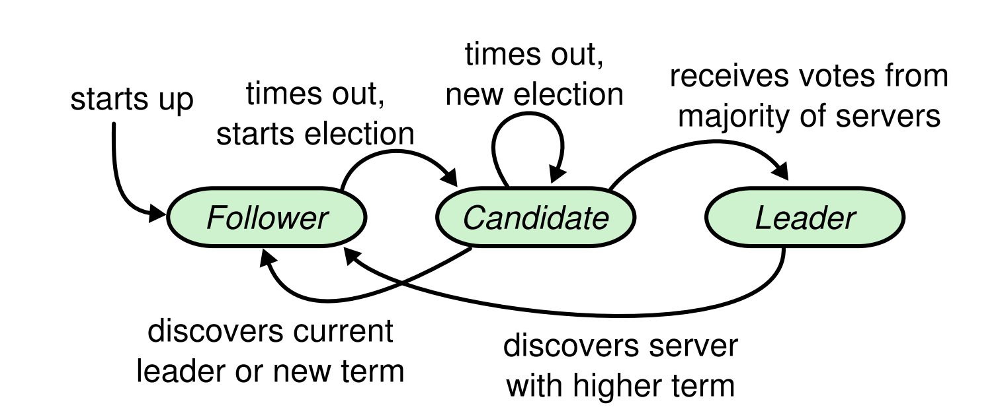
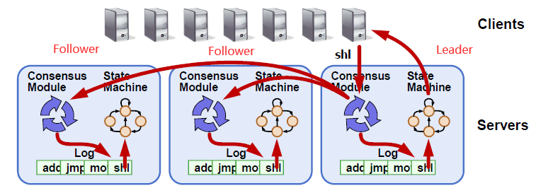
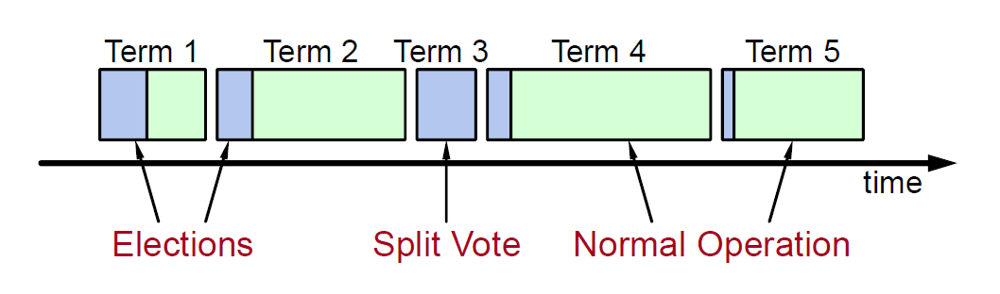
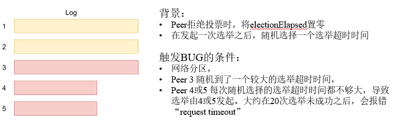
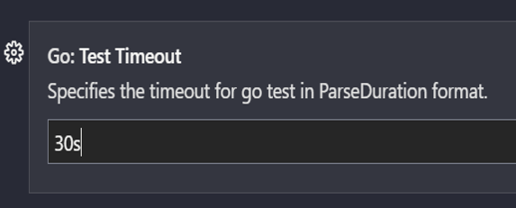
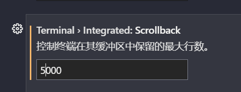
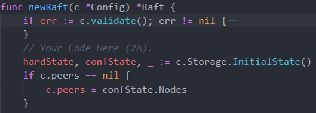

# Project2 RaftKV

## project2A Basic Raft algorithm

2A 分为3个部分：

- 2aa: Leader election 领导人选举
- 2ab: Log replication 日志复制
- 2ac: Rawnode interface Rawnode接口

其中 2aa 的 Leader election 和 2ab 的 Log replication 是对 Raft 基础算法的实现。2ac 的 Rawnode 对 Raft 封装，构成一个能收发消息的完整节点。

#### scr file

- raft/log.go

  RaftLog 提供日志和磁盘存储。和 kvdb 和 raftdb 不同，RaftLog中的entry是在内存中的。

- raft/raft.go

  实现 Raft 基础算法，包括不同身份(Leader,Candidate,Follower)对应的操作和各种类型消息的处理。

- raft/rawnode.go

  Rawnode 封装 Raft,是与上层应用交互的接口，提供 Ready(),Advance() 等 API。

#### test file

- raft_test.go 2aa&2ab
- raft/raft_paper_test.go 2aa&2ab
- rawnode_test.go 2ac

#### 阅读材料

Raft 是一个分布式一致性算法。要能完成 2aa、2ab，需要理解清楚 Raft。下面推荐一些能帮助理解 Raft 的阅读材料：

- [the Raft site](https://raft.github.io/) 包括了 Raft
  算法的介绍和可视化例子
- [the extended Raft paper](https://raft.github.io/raft.pdf) Raft 论文
- [etcd Raft库解析](https://www.codedump.info/post/20180922-etcd-raft/) TinyKV 的 Raft 实现和 etcd 的比较类似，实现过程中有部分参考 etcd。

#### 预备知识

**Raft算法中的三种角色（Role）：**



- 领导者（Leader）：由选举产生。负责接收处理客户端请求，和同步日志条目给其他节点。每隔一段时间向跟随者发送心跳来维持领导状态。
- 候选者（Candidate）：由跟随者选举超时转变而来。发送选举信息和统计选票，如果获得超过半数的同意选票，则转换为领导者；否则转换为跟随者。
- 跟随者（Follower）：各节点初始为 Follower 。被动接收领导者的日志条目信息、响应候选者投票。如果选举超时则转换为候选者。

**日志复制 （Log Replication） :**

日志条目包含了用户的请求，如对数据库的增删查改等。

正常情况下，一个任期内的 Raft group 中只有一个 Leader, Leader 接收用户端请求并包装成日志，Follower 通过日志复制机制使自己的日志与 Leader 保持一致，进而使整个集群日志一致。

当 Leader 确认该日志已经在过半的节点都有备份时，提交（commit）日志，并通知其他节点。各节点异步将已经提交的日志请求应用（apply）在自己的状态机上。



当多个服务器各自都从相同的初始状态开始，执行顺序内容相同的一系列命令（复制的日志），产生的最终状态一定相同。这样各节点的状态（比如数据库的数据项、值等）就能保持完全一致。

**任期 （Term）:**   

Raft 中，时间轴被划分为若干任期 (Term) 。每个任期都由选举阶段和领导者阶段组成。（注：两个候选者竞争分票可能导致无法选出 Leader。如果没选出 Leader 则只有选举阶段）



当选举超时，Follower 自增 Term 成为 Candidate，发起新的选举。当选后成为 Leader，仍沿用候选时 Term。正常情况下，一个 Term 对应唯一的 Leader 。

任期的作用是标识过期的信息。Raft 中，各节点会保留自己已知的最大 Term， 所有消息都会包含发送方的 Term。

当接收方收到消息的时候，如果消息的 Term 大于自己，则更新自己的 Term。

如果消息的 Term 小于自己，节点就知道消息已经过期，从而采取相应步骤。比如对一个任期过期的 Leader 发送 AppendRPC 请求做拒绝。而一个 Leader 若接收到 Term 大于自己的消息，则放弃领导权转换为 Follower。

### 2aa：Leader Election

领导者选举中，需要实现领导者选举的触发(tick)、角色转变(becomeCadidate)，发送选票请求(sendRequestVote)、处理投票请求(handleRequestVote)、处理选票(handleRequestVoteResponse)、当选(becomeLeader)等。

#### Raft 结构

在开始实现领导者选举前，首先介绍 `Raft` 数据结构。 Raft 包含以下内容:

```go
type Raft struct {
	id uint64

	Term uint64
	Vote uint64
	RaftLog *RaftLog

	Prs map[uint64]*Progress

	State StateType
	votes map[uint64]bool

	msgs []pb.Message

	Lead uint64

	heartbeatTimeout int
	electionTimeout int
	heartbeatElapsed int
	electionElapsed int

  //extra structure
  VotedFor              uint64
  VotedReject           uint64
  randomElectionTimeout int

	// (Used in 3A leader transfer)
	leadTransferee uint64
	// (Used in 3A conf change)
	PendingConfIndex uint64
}
```

基本信息：

- id : 节点收发消息的标识
- Term : 节点已知最大任期
- RaftLog : 存储日志相关的信息，包括Entries，commit和apply等
- Prs : 一个map，存储 Raft 组其他节点的信息，包括id，Next，Match
- State : 角色消息，0对应 Folloewer， 1对应 Candidate，2对应 Leader
- Lead : 节点当前的 Leader

选举相关：

- Vote : 自己的选票投出给的节点
- votes : 作为候选者时接收到的选票信息统计

为了更方便统计选票信息，增加数据结构：

- VotedFor : 接收到的同意选票数
- VotedReject : 接收到的拒绝选票数

逻辑时钟相关：

- heartbeatTimeout : 心跳间隔， Leader 会周期性发送心跳给 Follower 以维持领导状态
- electionTimeout : 选举超时时间，Follower 会在选举超时后成为 Candidate。
- heartbeatElapsed : 目前经过的心跳时间
- electionElapsed : 目前经过的选举时间

为使选举超时为随机，增加数据结构：

- randomElectionTimeout : 在 electionTimeout 的基础上构建的随机选举超时时间，每个节点不同

消息发送：

- msgs : 是一个消息队列，将节点待发送的消息append至该数组中，上层取走消息才会真正发送消息

其他如 leadTransferee 和 PendingConfIndex 到 3A、3B 才会用到，此处不再赘述。

#### Raft 中的消息和消息收发

**Message:**
`MsgType` 和 `To` 是必须的，其他字段可含可不含（保持默认值），由MsgType决定。

```go
type Message struct {
	MsgType              MessageType
	To                   uint64      
	From                 uint64      
	Term                 uint64      
	LogTerm              uint64      
	Index                uint64      
	Entries              []*Entry    
	Commit               uint64    
	Snapshot             *Snapshot   //2C
	Reject               bool        
    ...
}
```

**消息类型:**
项目定义的消息类型共12种，定义和用法详见 `proto/pkg/eraftpb/eraftpb.pb.go`。

```go
type MessageType int32
const (
  //local Message
  MessageType_MsgHup MessageType = 0
  MessageType_MsgBeat MessageType = 1
  MessageType_MsgTransferLeader MessageType = 11
  MessageType_MsgTimeoutNow MessageType = 12

  //None local Message
  MessageType_MsgPropose MessageType = 2
	MessageType_MsgAppend MessageType = 3
	MessageType_MsgAppendResponse MessageType = 4
	MessageType_MsgRequestVote MessageType = 5
	MessageType_MsgRequestVoteResponse MessageType = 6
	MessageType_MsgHeartbeat MessageType = 8
	MessageType_MsgHeartbeatResponse MessageType = 9

  //SnapShot Message
  MessageType_MsgSnapshot MessageType = 7
)

```

2A 涉及到本地消息两种: `MessageType_MsgHup`、`MessageType_MsgBeat`，非本地消息三对： `RequestVote`、`AppendEntries`、`HeartBeat` 以及它们对应的 Response 。

和 Raft 论文不同，项目实现将原始的 Append 拆分为 AppendEntries 和 HeartBeat两种不同的消息类型，使逻辑更清晰。但这样也带来了一些问题，后面再详细说。

**消息收发:**
2A 项目屏蔽了消息接收的具体逻辑。所有接收消息的处理都在 `Step()`中实现；所有需要发送的消息都 apend 到 msgs 消息队列中即可。（Test中会将相应代码补全）

RawNode 封装了 Raft，与外界消息对接。它将 Raft 中的 msgs 和状态更新打包成 `Ready`，发送给外界，并对返回的执行结果调用 `Advance()`处理。

（用计算机硬件来打比方，RawNode 相当于主板，Raft、RaftLog 相当于 CPU 和 CPU 缓存。各部件通过主板的连接实现了沟通。）

消息发送：

```go
msg := pb.Message{
		MsgType: pb.MessageType_MsgRequestVote,
		To:      to,
		From:    r.id,
		Term:    r.Term,
      ...
	}
	r.msgs = append(r.msgs, msg)
```

消息处理：

```go
func (r *Raft) Step(m pb.Message) error {
	// Your Code Here (2A).
	switch r.State {
	case StateFollower:
		switch m.MsgType {
		case pb.MessageType_MsgHup:
      r.becomeCandidate()
		case pb.MessageType_MsgAppend:
			r.handleAppendEntries(m)
		case pb.MessageType_MsgRequestVote:
			r.handleRequestVote(m)
        ...
    }
	case StateCandidate:
		switch m.MsgType {
		    ...
      }
  case StateLeader:
    switch m.MsgType {
        ...
      }
    }
}
```

#### 领导者选举触发

**tick() ：** Tick是一个逻辑时钟。系统间隔一段时间自动调用 Raft 节点中的 `tick()` 函数。每调用一次，逻辑时间增加1。分角色做不同处理：

Follower/Candidate：

1. electionElapsed增加1。
2. 若选举超时，则发起选举。给自己发送本地消息 `pb.MessageType_MsgHup`，触发选举。

补充说一下 Leader 对 tick 的处理：

Leader：

1. heartbeatElapsed增加1。
2. 若心跳超时，则广播心跳给各 Follower。给自己发送本地消息 `pb.MessageType_MsgBeat`。（一般heartbeatTimeout<<electionTimeout）。属于后续阶段。

```go
func (r *Raft) tick() {
  // Your Code Here (2A).
  //1.时间增加
  //2.判断是否超时
  switch r.State {
  //2.1 Follower、candidate选举超时，处理：变成候选者，重新选举
  case StateFollower, StateCandidate:
    r.electionElapsed++
    if r.electionElapsed >= r.electionTimeout {
      r.resetTimeout()
      r.Step(pb.Message{MsgType: pb.MessageType_MsgHup})
    }
    //2.2 Leader心跳超时，处理：更新心跳并bcast心跳给所有追随者
    case StateLeader:
  		...
}
```

#### 转变为候选者

**处理本地的选举消息：** 在`Step()` 中，选举超时的节点处理发送给自己的本地消息，开始选举。

如果只有自己一个节点，则直接当选；否则，成为候选者并广播投票请求。

```go
func (r *Raft) Step(m pb.Message) error {
	// Your Code Here (2A).
	switch r.State {
  	case StateFollower:
    case StateCandidate:
    switch m.MsgType {
      case pb.MessageType_MsgHup:
        r.becomeCandidate()
        if len(r.Prs) == 1 {
          r.becomeLeader()
        } else {
          r.bcastRequestVote()
        }
      }
```

**becomeCadidate()：** 和论文流程差不多，唯一不同的是 `becomeCandidate()` 只改变节点的状态，而不用广播投票请求。（否则测试通不过）

```go
func (r *Raft) becomeCandidate() {
	// Your Code Here (2A).
	//状态更新为Candidate，
	r.State = StateCandidate
	//任期++，
	r.Term++
	//清除以前的选票
	r.VotedReject = 0
	r.VotedFor = 0
	r.votes = make(map[uint64]bool, 0)
	r.Vote = None
	//自己给自己投票
	r.Vote = r.id
	r.votes[r.id] = true
	r.VotedFor++
}
```

#### 发送投票请求

**bcastRequestVote()：**  Candidate 广播选举消息给除自己以外所有的 peers。消息包含自己最新的日志 Index 和 Term 信息，以在选举时选出日志最新的节点作为 Leader。

```go
**bcastRequestVote()：**
func (r *Raft) bcastRequestVote() {
	//候选者发送选举消息给除自己以外所有的peers
	lastLogIndex := r.RaftLog.LastIndex()
	lastLogTerm, _ := r.RaftLog.Term(lastLogIndex)
	for peer := range r.Prs {
		if peer != r.id {
			r.sendRequestVote(peer, lastLogTerm, lastLogIndex)
		}
	}
}
```

**sendRequestVote()：** 包含自己的 id, 新任期号 Term, 和日志信息。

- lastLogTerm : Candidate 的最新一条日志的 Term
- lastLogIndex : 该最新日志的 Index

```go
func (r *Raft) sendRequestVote(to uint64, lastLogTerm uint64, lastLogIndex uint64) {
	msg := pb.Message{
		MsgType: pb.MessageType_MsgRequestVote,
		To:      to,
		From:    r.id,
		Term:    r.Term,
		LogTerm: lastLogTerm,
		Index:   lastLogIndex,
	}
	r.msgs = append(r.msgs, msg)
}
```

#### 处理投票请求

其他节点在收到了候选者的RequestVote消息时，经过 Step() 进入该消息的处理阶段 `handleRequestVote()`。

**handleRequestVote(m)：**  

1. 如果 m.Term < r.Term，说明消息的任期过期，投拒绝票。
2. 如果 m.Term > r.Term，说明自己的任期过期。此时应该更新自己的任期至最新并成为 Follower。但不一定投赞成票（还要看日志新旧)。
3. 如果 m.Term 等于 r.Term，且在该任期内已经给除该 Candidate 以外的其他节点投过票，返回拒绝票。
4. 如果 Candidate 和自己的日志至少一样新(先判断 Term 再判断 Index )，则投赞同票；否则拒绝。（希望选出日志较新的 Leader ）

```go
func (r *Raft) handleRequestVote(m pb.Message) {
	//1.任期是否过期，return false
	if m.Term < r.Term {
		r.sendRequestVoteResponse(m.From, false)
		return
	}
	//2 如果消息中的任期更大，成为追随者。但不一定投票（还要看Term和Index)
	if m.Term > r.Term {
      r.becomeFollower(m.Term, None)
	}
	//2.2 如果在消息的任期内已经给其他节点投过票，return false
	if m.Term == r.Term && r.Vote != None && r.Vote != m.From {
      r.sendRequestVoteResponse(m.From, false)
      return
	}
  //3.如果候选者日志没有自己新，(先判断Term再判断Index)，return false
    lastLogIndex := r.RaftLog.LastIndex()
    lastLogTerm, _ := r.RaftLog.Term(lastLogIndex)
    if lastLogTerm > m.LogTerm || lastLogTerm == m.LogTerm && lastLogIndex > m.Index {
      r.sendRequestVoteResponse(m.From, false)
      return
    }
  //4.否则，投票给候选者
    r.becomeFollower(m.Term, None)
    r.Vote = m.From
    r.sendRequestVoteResponse(m.From, true)
}
```

**sendRequestVoteResponse()：** 发送投票请求的回复给Candidate。包含 id,Term 和 Reject。

```go
func (r *Raft) sendRequestVoteResponse(to uint64, voteGranted bool) {
	msg := pb.Message{
		MsgType: pb.MessageType_MsgRequestVoteResponse,
		To:      to,
		From:    r.id,
		Term:    r.Term,
		Reject:  !voteGranted,
	}
	r.msgs = append(r.msgs, msg)
}
```

#### 处理选票

候选者在收到其他节点的 RequestVoteResponse 消息时，经过 `Step()` 进入该消息的处理阶段 `handleRequestVoteResponse()`。

**handleRequestVoteResponse(m)：**  
Candidate 接收到投票请求回复后，统计票数。

- 当赞成票 > Prs/2 数量，becomeLeader()
- 当拒绝票 > Prs/2 数量，becomefollower()

```go
func (r *Raft) handleRequestVoteResponse(m pb.Message) {
	//1.统计选票数
	if m.Reject {
		r.VotedReject++
		r.votes[m.From] = false
	} else {
		r.VotedFor++
		r.votes[m.From] = true
	}
	//超过半数就可以决定是当选还是落选
	//2. 过半同意，成为领导者
	if r.VotedFor > uint64(len(r.Prs)/2) {
		r.becomeLeader()
		return
	}
	//3. 过半反对，退回追随者
	if r.VotedReject > uint64(len(r.Prs)/2) {
		r.becomeFollower(r.Term, None)
	}
}
```

#### 当选

**becomeLeader()：**  
当 Candidate 统计到过半的赞同选票，则当选该任期的 Leader。Leader 发送一个包含 noop entry（空日志）的 Append 消息给其他节点，表明自己当选。

```go
func (r *Raft) becomeLeader() {
	// Your Code Here (2A).
	// NOTE: Leader should propose a noop entry on its term
	log.Infof("+++ %d becomeLeader", r.id)
	//1. 状态转换
	if r.State != StateLeader {
		r.resetTimeout()
		r.State = StateLeader
		r.Lead = r.id
		r.leadTransferee = None
	}
	//2.对于leader，会维护每个节点的日志状态，初始化Next为lastLogIndex+1
	lastLogIndex := r.RaftLog.LastIndex()
	for peer := range r.Prs {
		if peer != r.id {
			r.Prs[peer].Next = lastLogIndex + 1
		}
		if peer == r.id {
			r.Prs[peer].Next = lastLogIndex + 2
			r.Prs[peer].Match = lastLogIndex + 1
		}
	}
	// 3.发送带空data的entries的AppendEntries的消息
	r.RaftLog.entries = append(r.RaftLog.entries, pb.Entry{Term: r.Term, Index: lastLogIndex + 1})
	//广播Append
	for peer := range r.Prs {
		if peer != r.id {
			r.sendAppend(peer)
		}
	}
	   ...
}
```

### 2ab：Log replication

实现raft的日志复制部分。

#### 具体实现

主要是实现在Step()中收到`MessageType_MsgPropose`、`MessageType_MsgAppend`和`MessageType_MsgAppendResponse`三种类型的消息后的处理流程。

##### handleMsgPropose() 

处理收到的MsgPropose:
1.MsgPropose是本地消息，一般只会由领导者收到。
2.领导者收到消息后需要将消息中的entry取出，设置Term和Index然后append到RaftLog，并修改自身的Match和Next。
3.最后对所有Prs发送一个Append消息。

##### sendAppend()

将消息发给指定的peer：
1.最好先检查一下Prs[]中是否有对应的peer，确保后续没有bug。
2.判断r.Prs[to].Next和FirstIndex()的关系，确定是否需要发送快照，如果需要则发送快照并返回。(因为Peer需要的下一个log可能已经不在entries中)
3.构造MsgAppend发送给指定的peer，节点间消息传递的方式是将构造好的消息append到r.msgs中。

##### handleAppendEntries()

处理收到的Append消息：
1.如果收到消息的Term比当前节点的Term小，回复拒绝的Response。
2.如果收到消息的Term比当前节点的Term大或者相等，则当前节点先变为Follower。
3.接下来判断发送过来的prevIndex和当前节点LastIndex的关系：
  如果 prevIndex >  LastIndex 则返回拒绝的Response。
  如果 prevIndex <= LastIndex 则继续处理。
4.添加Append消息中所有entries到当前节点，每个entry的index都需要和LastIndex进行比较，可能需要覆盖当前节点上已经存在的entry。

##### sendAppendResponse()

构造一个MsgAppendResponse类型的消息返回。

##### handleMsgAppendResponse()

根据MsgAppendResponse中的信息判断进行操作：
1.如果peer需要的entry已经不在entries中，需要发送快照(2C)。
2.如果peer需要的entry下标不匹配则递减再继续尝试sendAppend。
3.MsgAppendResponse中没有收到拒绝，则统计所有prs的Match尝试提交。

#### 处理流程

日志复制的流程基本都是在raft层处理完，最初的MsgPropose是由上层RawNode发起，之后所有消息流程都是经过step()函数处理。

消息处理的顺序可以参考raft_test.go中的send(m pb.Message)函数。

### 2ac

#### 任务说明

**实现`RawNode`接口**

​	`raft/rawnode.go`中的`raft.RawNode`是为上层应用提供的接口，它包含了`raft.Raft`并且提供了一些函数如`Rawnode.Tick()`和`Rawnode.Step()`，并且还提供了`RawNode.Proposal()`来让上层应用附加新的raft日志。

​	这里还引入了一个重要的结构体`Ready`。当处理上层消息或推进逻辑时钟时，`raft.Raft`可能需要与上层应用程序交互，需要做的事情如：

- 给其他peer发送消息
- 保存日志信息到持久化存储中
- 保存状态信息如term、commit index、vote等
- 将日志中的操作应用在状态机中
- ……

​	但是上述操作并不是直接由`Raft`发起并立即执行的，它们所需的关键信息被包含在`Ready`结构体中并通过`RawNode.Ready()`返回给上层逻辑处理（这部分内容我们将在2b部分的`peerMsgHandler`的实现中看到）。

`Ready`的具体信息如下所示：

```go
type Ready struct {
	// The current volatile state of a Node.
	// SoftState will be nil if there is no update.
	// It is not required to consume or store SoftState.
	*SoftState

	// The current state of a Node to be saved to stable storage BEFORE
	// Messages are sent.
	// HardState will be equal to empty state if there is no update.
	pb.HardState

	// Entries specifies entries to be saved to stable storage BEFORE
	// Messages are sent.
	Entries []pb.Entry

	// Snapshot specifies the snapshot to be saved to stable storage.
	Snapshot pb.Snapshot

	// CommittedEntries specifies entries to be committed to a
	// store/state-machine. These have previously been committed to stable
	// store.
	CommittedEntries []pb.Entry

	// Messages specifies outbound messages to be sent AFTER Entries are
	// committed to stable storage.
	// If it contains a MessageType_MsgSnapshot message, the application MUST report back to raft
	// when the snapshot has been received or has failed by calling ReportSnapshot.
	Messages []pb.Message
}
```

上层在处理完获取到的`Ready`内容后将调用`RawNode.Advance()`来更新`raft.Raft`的应用日志索引和存储日志索引等状态，也就是需要保存的节点状态、应用的日志、存储的日志、保存的快照（2c部分）以及处理的消息等。

#### 具体实现

​	`RawNode`中所需要存储的信息除了自带的Raft结构外，还有Raft的状态信息（`SoftState`和`HardState`）。这部分信息的作用在于方便`RawNode`在向上层提交`Ready`时，判断当前是否有已改变的状态待提交，因此准确地说是`Raft`“旧”的状态信息。

##### `NewRawNode()`

​	此函数用于生成和初始化一个`RawNode`，需要确保：

1. 下层的Raft正确生成和初始化
2. 记录旧状态的变量正确初始化

##### `Ready()`

​	此函数需要将当前待提交的信息填入`Ready`结构并返回，需要提交的信息可能包括：

1. `softState`和`hardState`，通过比较`RawNode`中存储的旧状态信息以及Raft中现有的状态信息即可判断是否需要提交；
2. 待持久化的日志，可直接调用`RaftLog`中实现的`unstableEntries()`方法；
3. 已提交但还没有被应用的日志，可调用`RaftLog`中实现的`nextEnts()`方法；
4. 下层Raft待发送的信息，可检查其消息队列长度，并拷贝至Ready，同时将原消息队列置空；
5. 对于后面的2ac部分，还需要检查是否存在`pendingSnapshot`，并将其填入Ready，实现2aa时可先不管。

##### `HasReady()`

​	此函数用于判断当前是否存在待提交的`Ready`，其主要流程与Ready()中的判断一致，最后返回是否有待提交的信息即可。

##### `Advance()`

​	当上层处理完之前提交的`Ready`后，会调用此函数，以之前提交的Ready作为参数，更新`RawNode`及其下的`RaftLog`中的信息。需要更新的内容包括：

1. 若`Ready`中提交了`softState`和`hardState`，需要将ready中的这部分信息保存至`RawNode`的旧信息记录中，用于下一次比对；
2. 若`Ready`中提交了待持久化的`Entries`以及待应用的`Entries`，需要更新`RaftLog`中的`stabled`值和`applied`值；
3. （2c）若Ready中提交了`pendingSnapshot`，应将其与`RaftLog`中的`Snapshot`进行比较，若一致则清空该`Snapshot`。

​	`RawNode`的作用主要在于提供一层封装，对上层屏蔽下层Raft的细节，而Raft也无需针对上层特化实现，相对而言降低了耦合性。

### 问题

1. **测试不通过时，要去理解测试的逻辑，反推代码。**

   例子：比如TestCandidateStartNewElection不通过时，发现是未将becomeCadidate() 中的状态修改和发送消息的逻辑拆开，导致有多余消息产生。

2. **follower处理AppendEntries追加日志时，错误增加了已经存在的日志条目**

   解决：重读论文流程，注意到细节：handleAppendEntires中，当follower确定日志没有冲突后，应该对leader发送的Entries进行一遍筛选，去掉与自己重复的日志条目。

3. **配置时没有成功初始化Vote状态，导致选举leader过程出错**

   解决：没有在newRaft()中加载Storage的hardState。

4. **跟随者，拒绝投票时，需要将选举超时时间置0吗？**

   解决：拒绝投票不应重置electionElapsed, 否则在极少数情况下（1%），会导致无法在要求的时间内选举出Leader。

   

5. **`MessageType_MsgBeat`和`MessageType_MsgHeartbeat`两个信号类型有什么区别？**

   解决：`MessageType_MsgBeat`：领导者告诉自己需要发送'MessageType_MsgHeartbeat'类型的心跳给他的跟随者们

   `MessageType_MsgHeartbeat`：从领导者发送心跳到他的追随者的信号

6. **Ready结构体中Entries和CommittedEntries的含义**

   Entries指的是在发送消息之前需要保存到稳定存储的表项，即未持久化的日志条目，即stabled之后的entry；

   CommittedEntries指的是要提交到状态机的条目，即已提交但还未应用到状态机的条目，即applied到 commited之间所有的 entry。

7. **一直显示超时`dial tcp 142.251.43.17:443: i/o timeout`**

   解决：`go env -w GOPROXY=https://goproxy.cn`

## 2B

### 任务说明

使用 Part A 中实现的 Raft 模块建立一个容错的KV存储服务。

`raft2B`主要的数据流如图所示，需要注意的是这里面应该是由多个`raft_worker`为了简便画成了一个。每个`raft_worker`负责一个`peer`的工作，准确来说是多个`region`中的一个`peer`，但是在`2B`中并未涉及到多个`region`，可以看作是一个`raft_worker`负责一个`peer`的工作。我们所需要完成的任务也就是在`raft_woker`的下面一层。


在2A中实现的是RawNode下层的东西，可以理解为只是实现了一个Raft库，而在2B我们需要接触的是整个KV服务的处理流程。首先我们需要知道TinyKV中三个重要的概念：


- Store：每一个节点叫做一个store。在代码里是RaftStore
- Peer：一个RaftStore里面会包含多个peer，一个RaftStore里面所有peer共用底层存储
- Region：一个Region叫做一个Raft group ，一个Region包含多个peer，这些peer位于不同的RaftStore上

#### RaftStore

RaftStore 会在节点启动的时候被创建，它负责维护在该节点上所有的 region 和对应的 peer，也就是负责Multi Raft的实现。

RaftStore被启动后，首先会加载peers，然后将peers注册进router。之后RaftStore的主要工作就是接收来自其他RaftStore的msg，然后根据msg里面的region信息，将msg发给对应的peer上，同时也需要将自己的peer信息发送给其他RaftStore。RaftStore会启动多个worker来实现以上工作，以及实现发送快照、GC等其他工作。


##### RaftWorker

RaftWorker的作用是运行 raft commands 和 apply raft logs

通过`run()`方法实现，

```go
// run runs raft commands.
// On each loop, raft commands are batched by channel buffer.
// After commands are handled, we collect apply messages by peers, make a applyBatch, send it to apply channel.
func (rw *raftWorker) run(closeCh <-chan struct{}, wg *sync.WaitGroup) {
	defer wg.Done()
	var msgs []message.Msg
	for {
		msgs = msgs[:0]
		select {
		case <-closeCh:
			return
		case msg := <-rw.raftCh:
			msgs = append(msgs, msg)
		}
		pending := len(rw.raftCh)
		for i := 0; i < pending; i++ {
			msgs = append(msgs, <-rw.raftCh)
		}
		peerStateMap := make(map[uint64]*peerState)
		for _, msg := range msgs {
			peerState := rw.getPeerState(peerStateMap, msg.RegionID)
			if peerState == nil {
				continue
			}
			newPeerMsgHandler(peerState.peer, rw.ctx).HandleMsg(msg)
		}
		for _, peerState := range peerStateMap {
			newPeerMsgHandler(peerState.peer, rw.ctx).HandleRaftReady()
		}
	}
}
```

`RaftWorker`的工作可以归纳为：取一个batch的 msg 后，逐条使用`peerMsgHandler`处理消息。`peerMsgHandler`是处理消息的和处理`Ready`的重点，也是之后project的重点，可以将`peerMsgHandler`理解为挂在Peer上的螺丝刀，需要的时候就去拧一下，其本身是不存储任何数据的。

##### StoreWorker

`StoreWorker`负责store上的一些功能，如转发消息、新建Peer等。

##### RegionWorker

`RegionWorker`主要接受来自于NewPeerStorage的消息。主要有三种任务，接收产生Snap的请求，应用Snap消息和删除region中Range的key

##### SchedulerWorkers

`schedulerWoker`主要有三个任务，接收来自region(peer leader)的心跳，接收来自store的心跳，接受来自region的split请求。

##### SplitCheckWorker

`SplitCheckHandler`只承担关于`Split`的工作。`splitCheck`会检查`key range`是否超过指定值，如果超过则返回一个分割key,如果没有超过的话则会发送一个调整自身`key range`大小的消息。`OnSplitRegionCheckTick`定时会调用判断自己是否需要分割。收到分割消息以后会调用分割方法，判断分割范围是否有效，最后向`SchedulerTask`发送一个请求分割的消息。

##### raftLogGCWorker

`raftLogGCWorker`同样也只处理一种任务。`gcRaftLog`函数删除所有需要被回收的`Log`，并且返回它的长度。

以上Worker共同承担了RaftStore的工作，现阶段需要关注的是`RaftWorker`以及其使用的`PeerMsgHandler`

#### PeerMsgHandler

前面提到，`peerMsgHandler`可以理解为挂在Peer上的螺丝刀。其主要有两个方法：

##### HandleMsg()

`HandleMsg(msg message.Msg)` 负责分类处理各种 msg:

- MsgTypeRaftMessage，Project 2A 中的Raft内部msg，这里需要对msg进行检查，然后通过 RawNode 的 `Step() `方法直接输入
- MsgTypeRaftCmd，从 client 或自身发起的请求，比如 Admin 管理命令，read/write 等请求，需要根据请求的类型进行处理
- MsgTypeTick，驱动 RawNode 的 tick 
- MsgTypeSplitRegion，触发 region split，在 project 3B split 中会用到。
- MsgTypeRegionApproximateSize，修改自己的 ApproximateSize 属性，不用管。
- MsgTypeGcSnap，清理已经安装完的 snapshot。
- MsgTypeStart，启动 peer，新建的 peer 的时候需要发送这个请求启动 peer，在 Project3B split 中会遇到。

##### HandleRaftReady()

该方法的作用是在该Peer有需要时，就获取Ready并处理Ready，是Project 2B主要实现的模块。具体实现流程在后面讲诉。

### 具体实现

#### 实现 peer storage

peer storage通过Part A中的rawNode接口与raft进行交互，但是除了raft日志外，peer storage还需要管理其他一些持久化的数据。在`proto/proto/raft_serverpb.proto`定义了三种状态：

- RaftLocalState：用于持久化存储HardState 和 last Log Index
- RaftApplyState：用于持久化存储`Raft.RaftLog.applied` 和truncated Log 信息
- RegionLocalState：用于持久化存储 Region 信息和该 Store 上的 Peer state。Normal表示该 peer 是正常的，Tombstone表示该 peer 已从 Region 中移除

这些状态被存储在两个badger实例中：raftdb 和 kvdb

- raftdb 存储 raft log 和 `RaftLocalState`
- kvdb 存储 key-value数据，`RegionLocalState` and `RaftApplyState`.

以上需要持久化的数据存储格式如下：

| Key              | KeyFormat                        | Value            | DB   |
| ---------------- | -------------------------------- | ---------------- | ---- |
| raft_log_key     | 0x01 0x02 region_id 0x01 log_idx | Entry            | raft |
| raft_state_key   | 0x01 0x02 region_id 0x02         | RaftLocalState   | raft |
| apply_state_key  | 0x01 0x02 region_id 0x03         | RaftApplyState   | kv   |
| region_state_key | 0x01 0x03 region_id 0x01         | RegionLocalState | kv   |

##### SaveReadyState()

在这部分你需要实现 `PeerStorage.SaveReadyState`，这个函数的作用是将 `raft.Ready` 中的数据保存到 badger 中，但只包括**追加日志**和**保存RaftLocalState**，其余对`Ready`的操作会在后续`peer_msg_handler`里完成。

- 要追加日志，只需将`raft.Ready.Entries`的所有entries保存到raftdb。
- 要保存`RaftLocalState`, 只需更新peer storage 的 `RaftLocalState.HardState`, 并写入到raftdb

在一开始可能会感到棘手的是如何与badger实例交互，其实这非常简单，因为`engine_util`模块已经封装好了。例如，要持久化修改后的RaftLocalState，只需：

```go
raftWB := new(engine_util.WriteBatch)
err := raftWB.SetMeta(meta.RaftStateKey(ps.region.GetId()), ps.raftState)
if err != nil {
	return nil, err
}
raftWB.MustWriteToDB(ps.Engines.Raft)
```

##### Append()

在`PeerStorage.SaveReadyState`中，需要调用Append()函数将`raft.Ready.Entries`保存到raftWB。

在Append时，需要对齐`raft.Ready.Entries`和已有的entries，因为可能会有重复和被删除的情况。

> Hints:
>
> - 参考以上示例来持久化状态
> - 持久化HardState前需要判断其是否为空

### 实现 Raft ready 过程

`peerMsgHandler`主要有两个功能：一个是 `HandleMsgs`，另一个是 `HandleRaftReady`。

- HandleMsgs 处理所有从 raftCh 收到的消息，包括调用 RawNode.Tick() 驱动Raft的MsgTypeTick、包装来自客户端请求的 MsgTypeRaftCmd 和 Raft peer 之间传送的MsgTypeRaftMessage。所有的消息类型都在 kv/raftstore/message/msg.go 中定义。
- HandleRaftReady 从Raft 模块获得Ready，并做相应的动作，如持久化日志，应用已提交的日志，并通过网络向其他 peer 发送 raft 消息。

对一条客户端的消息，整个的读写过程是这样的：

- 客户端调用 RPC RawGet/RawPut/RawDelete/RawScan
- RPC 处理程序调用 `RaftStorage` 的相关方法
- `RaftStorage` 向 raftstore 发送一个 Raft command request，并等待响应
- `RaftStore` 将 Raft command request 作为 Raft Log 提出
- Raft 模块添加该日志，并由 `PeerStorage` 持久化
- Raft 模块提交该日志
- Raft Worker 在处理 Raft Ready 时执行 Raft command，并通过 callback 返回响应
- `RaftStorage` 接收来自 callback 的响应，并返回给 RPC 处理程序
- RPC 处理程序进行一些操作并将 RPC 响应返回给客户

##### peerMsgHandler.proposeRaftCommand()

该函数负责以上流程中 “`RaftStore` 将 Raft command request 作为 Raft Log 提出”

需要注意使用`peer.proposals`来保存callback，以供apply entry之后使用

##### peerMsgHandler.proposeRaftCommand()

该函数完成对`raft.Ready`的所有处理，

首先,，获取Ready

其次，完成以下三件事：

- sending raft messages to other peers through the network
- persisting log entries (modify raft_log and raft_state)
- applying committed entries and callback(modify kv_date and apply_state）

最后，调用`d.RaftGroup.Advance(ready)`

理清applying and callback的逻辑非常重要，建议将代码分拆成多个函数，在后续 project 中会对这块代码进行多次修改。

这里一开始可能会感到棘手的可能是Callback如何组织Response，示例如下：

```go
resp := &raft_cmdpb.RaftCmdResponse{
    Header:        &raft_cmdpb.RaftResponseHeader{},
    Responses:     []*raft_cmdpb.Response{},
    AdminResponse: nil,
}
for _, req := range msg.Requests {
    switch req.CmdType {
    case raft_cmdpb.CmdType_Get:
        value, err := engine_util.GetCF(d.peerStorage.Engines.Kv, req.Get.Cf, req.Get.Key)
        if err != nil {
            panic(err)
        }
        resp.Responses = append(resp.Responses, &raft_cmdpb.Response{
            CmdType: raft_cmdpb.CmdType_Get,
            Get:     &raft_cmdpb.GetResponse{Value: value},
        })
    case ......
}
proposal.cb.Done(resp)
```

> Hints:
>
> - PeerStorage 实现了 Raft 模块的存储接口，使用提供的SaveRaftReady() 方法来持久化Raft的相关状态。
> - 使用 engine_util 中的 WriteBatch 来进行原子化的多次写入，例如，你需要确保在一个WriteBatch中应用提交的日志并更新应用的索引。
> - 使用 Transport 向其他 peer 发送 raft 消息，它在 GlobalContext 中。
> - 在应用日志时，不要忘记更新和持久化应用状态。
> - 你可以像TiKV那样以异步的方式 Apply 已提交的Raft日志条目。这不是必须的，虽然对提高性能是一个很大的提升。
> - 提出命令时记录命令的 callback，应用后返回 callback。
> - 对于 snap 命令的响应，应该明确设置 badger Txn 为 callback。

### 问题

1. **如何根据MsgTypeRaftCmd创建日志条目信息？**

   解决方案：将client命令发送给peer下的raft进行处理。RawNode 有一个 Propose 方法，该方法可以将数据提供给 raft 。但是该方法使用的是 []byte 作为参数，这里我们要调用 msg.Marshal() 方法，该方法会返回一个 []byte ，里面包含了 msg 的数据。

2. **如何应用日志条目？**

   解决方案：调用util.go 文件里的功能函数对kvdb进行操作。

3. **2b初始化Raft的方式与2a不同**

   解决方案：节点重启后需要通过 Storage的 hardState 和 ConfState 以及 config 来恢复 Raft 内部状态。

4. **proposal可能和命令不一致？**

   解决方案：在处理 proposal 时，很有可能这条 proposal 是过时的，所以需要对比它的 index 和 entry 的index 来判断是否丢弃该过时的 proposal（对应的 RaftCmdRequest）。

5. **2b开始，都是并行，调试的难度比之前要大，需要借助观察debug日志来调试，设置环境变量LOG_LEVEL=debug，输出debug日志，有些问题要多次运行才能出现。**

6. **Admin的Command和其他Command的区别？**

   解决方案：2b只需处理Put,Get,Delete,Snap，其中Snap类似于Iter。Admin命令属于后续项目内容，如ConfChange (Change Peer & Transfer Leader) (Project 3C)、CompactLog (Project 2C)、Split (Project 3B)等。

7. **在2b的实现过程中可能会出现`peerMsgHandler`无限处理消息的情况**

   原因：每次提交ready时没有清空底层Raft的消息队列，导致消息被无限提交

   解决：每次Ready()拷贝完消息队列后，将下层Raft队列的消息队列清空即可。由于`RawNode`包括底层的Raft都跑在单线程下，不需要考虑消息队列的并发问题。

8. **候选者在接受到投票请求时，即使消息的任期更大，也是需要判断日志的新旧的，如果没有候选者的日志新，会拒绝。这本应在2A的时候就测试出来的，但2A的测试中没有这样的测试。**

9. **2b的日志起始任期和索引为5，不是0**

10. 之前在进行Debug的过程中，基本是通过打印信息来检查错误的，golang的fmt包提供的输出能力比较强大。但是在2b的多协程debug中打印的debug能力比较疲乏，还是使用tinykv提供的log包更加方便一些。**

11. **为什么底层存储要分为kvdb和raftdb，这样做的好处是？**

    原因：其实也可以存在一起，只是这样更加方便。

12. **Storage的Term接口是能够返回Snapshot槽位（第0号）的任期号的，因此Log模块里面的Term接口应该也要能返回这个任期号，否则会错误地返回ErrCompacted。**

13. **如果是在vscode中调试，可能会报时间超时错误**

    解决：vscode的默认超时时间是30s，可以设置中将timeout的时间设置长一些（比如300s），同时可以把终端的输出长度改一改(scrollback)，方便看日志调试。

    

    

14. **怎样运行单个测试并保存日志？**

    解决：修改makefile，把不需要的注释掉即可。

15. **出现报错：[error] handle raft message error raft: cannot step as peer not found**

    解决：

    在project 2A时，之前实现的方式是为Raft结构体增加了一个peers[]变量来保存peers。在project 2B进行测试时报错。

    需要将peers保存到Raft.Prs中，无需增加peers[]变量来保存。

    错误的具体位置是在`RawNode.Step()`该函数会通过Raft.Prs来检查msg来源。

16. **Raft的初始化未考虑到从confState.Nodes得到peers的情况**

    解决：如下，当Config.peers为空时，需要从Storage中的confState得到peers。

    

17. **在raft_worker中主循环run()是先处理完所有msgs后再处理  它们的ready并应用到持久性存储上，这样做会不会在同时有大量msg时阻塞，使得状态机一直维持原状？**

    解决：每次取msg总会有一个上限，不会一直阻塞。

18. **调试较为困难，有些错误还要回到2a代码去修改（即使2a测试通过仍会有问题）；并且有些问题要运行多次才能复现。**

    解决：调试时可用log.Infof打印出必要的信息（比如什么时候处理ready、raft算法中`sendAppend`和`handleAppendEntries`中的index信息和entires内容等），形成整个过程的日志，通过阅读日志再去定位问题的所在。

    对于要跑多次才能复现的bug，可用脚本自动化run并收集错误信息，顺便清除/tmp中的临时数据库文件，避免磁盘空间大量占用。

    https://bbs.dscl.team/d/30054-tinykv/3

19. **panic: requested index is unavailable due to compaction**

    原因：经过日志打印发现，某follower节点会突然处理许多AppendEntries，且这些append消息的m.Index逐渐递减，直到m.Index<r.RaftLog.FirstIndex，此时求Term(m.Index)导致错误。

    解决：在handleAppendEntries中加m.Index的判断条件可解决，但还没找到错误消息产生的原因（推测和分区有关）。

## 2C

### 任务说明

在本部分中，将在上述两部分实现的基础上实现快照处理。Snapshot 包含了某个时间点的整个状态机数据，并且一次构建和发送这么大的消息会消耗大量资源和时间，可能会阻塞其他 raft 消息的处理，为了解决这个问题，Snapshot 消息将使用独立的连接，并将数据拆分成块进行传输。

### 具体实现

#### raft/handleSnapshot()

1. 判断发送的快照是否过期，即 raft 本身是否已经含有快照中的日志，如果已经过期回复  `MessageType_MsgAppendResponse` 消息
2. 根据快照修改 raft 的信息，包括 firstIndex、committed、applied、stabled 等
3. 保存快照，同时将 raft 中已在快照中的日志进行压缩
4. 回复 `MessageType_MsgAppendResponse` 消息

#### peer_storage/ApplySnapshot()

1. 通过 `ps.clearMeta` 和 `ps.clearExtraData()` 清除原来的数据，因为新的 snapshot 会包含新的 meta 信息，需要先清除旧的。
2. 根据 Snapshot 的 Metadata 信息更新当前的 raftState 和 applyState。并保存信息到 WriteBatch 中。
3. 发送 `RegionTaskApply` 到 `regionSched` 应用 snapshot。


### 处理流程

1. 当 Leader 发送 append 日志给落后 node 节点时，发现对方所需要的 entry 在 Leader 中已经被压缩，即对方落后太多，此时 Leader 需要发送 Snapshot 给落后的节点进行日志同步。
2. 当 Leader 需要发送 Snapshot 时，调用 `r.RaftLog.storage.Snapshot()` 生成 Snapshot。因为 Snapshot 很大，不会马上生成，这里为了避免阻塞，如果 Snapshot 还没有生成好，Snapshot 会先返回 `raft.ErrSnapshotTemporarilyUnavailable` 错误，Leader 就应该放弃本次 Snapshot，等待下一次再次请求 Snapshot。
3. 下一次 Leader 请求 Snapshot 时，因为快照已经创建完成，直接发送 `pb.MessageType_MsgSnapshot` 消息至目标节点。
4. 在此过程中会将 Snapshot 切成小块，发送到目标 RaftStore 上面去。
5. 目标 RaftStore 在 `server.go` 中的 `Snapshot()` 接收发送过来的 Snapshot。之后生成一个 `recvSnapTask` 请求到 `snapWorker`中。`snap_runner.go` 中收到 `recvSnapTask` 请求，开始下载发送过来的 Snapshot 并保存在本地（此时还没应用），同时生成 `pb.MessageType_MsgSnapshot` 发送到要接收的 peer 上。
6. 目标 peer 会在 `OnRaftMsg()` 中像处理普通 msg 一样，将 `pb.MessageType_MsgSnapshot` 消息通过RawNode的 `Step()` 将消息发送到 Raft 中。
7. Raft 中则根据 Snapshot 中的 metadata 更新当前 raft 的各种状态并设置 `pendingSnapshot`，然后返回一个 `MessageType_MsgAppendResponse` 给 Leader。
8. 接收节点在 `HandleRaftReady()`→`SaveReadyState()`→`ApplySnapshot()` 中根据 `pendingSnapshot` 的 Metadata 更新自己的 raftState 和 applyState ，然后发送一个 `RegionTaskApply` 请求到 `region_task.go` 中。此时它会异步的把刚刚收到保存的 Snapshot 应用到 kvDB 中。

### 问题

1. **跟随者判断是否应用leader发送过来的快照是，需要用跟随者的已提交索引committed index 和快照的索引进行比较，而不是跟随者的最后一条日志的索引。**


